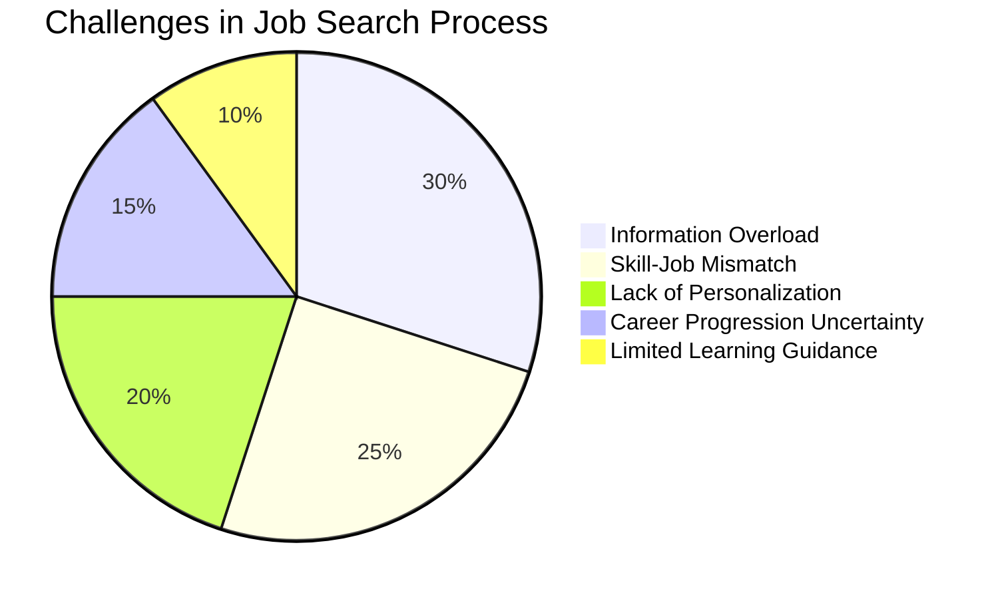
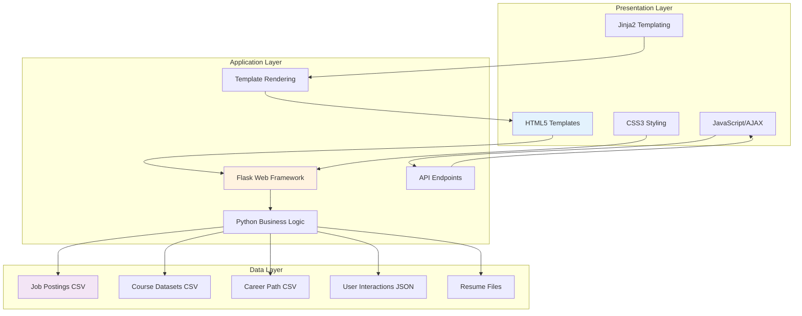
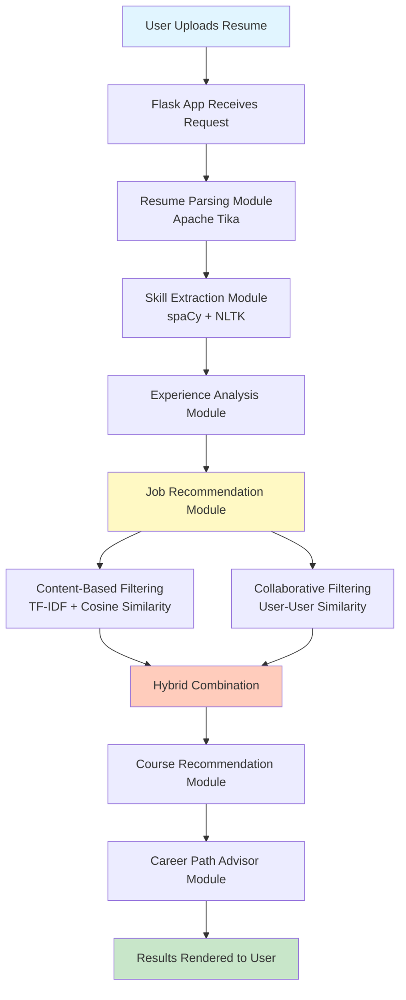
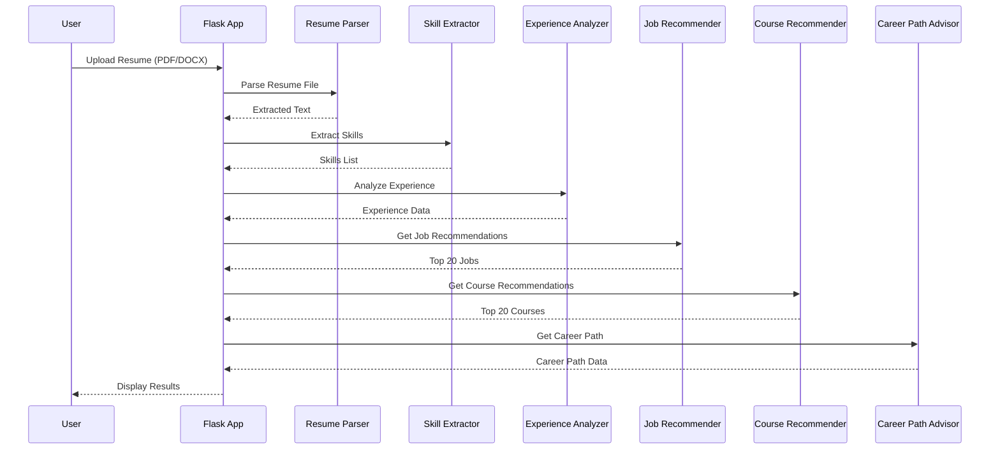
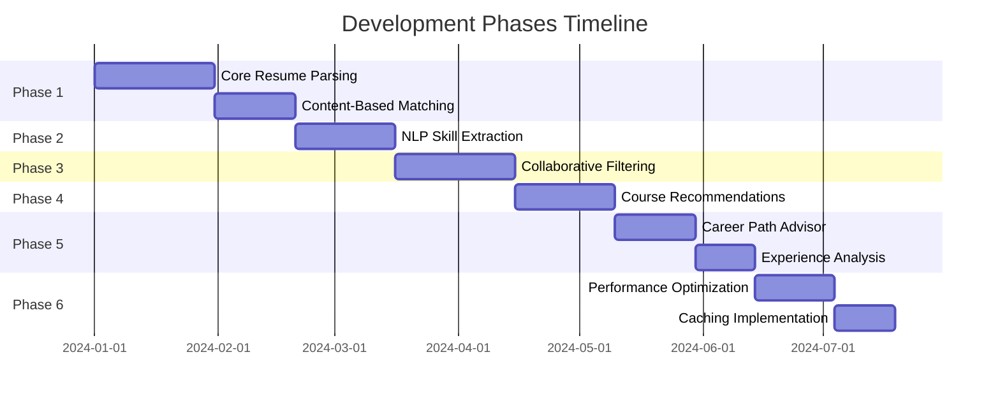
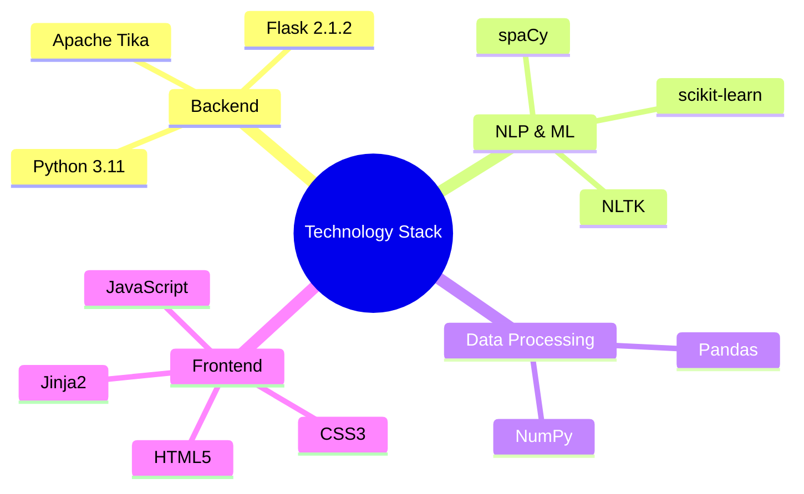

# Chapter 1: Introduction and System Overview

## 1.1. Introduction

### 1.1.1. Background and Problem Statement

The modern job market presents significant challenges for job seekers. With thousands of job postings available across multiple platforms, finding the right opportunity that matches one's skills, experience, and career aspirations has become increasingly difficult. Job seekers often spend countless hours browsing through job listings, manually comparing requirements with their qualifications, and struggling to identify positions that truly align with their professional goals.

The primary challenges in the current job search process include:

1. **Information Overload**: The sheer volume of job postings makes it difficult for candidates to identify relevant opportunities efficiently.

2. **Skill-Job Mismatch**: Many job seekers apply to positions without fully understanding whether their skills match the job requirements, leading to low application success rates.

3. **Lack of Personalization**: Generic job search platforms do not consider individual user preferences, career history, or learning needs.

4. **Career Progression Uncertainty**: Job seekers often struggle to understand what skills they need to develop to advance in their careers.

5. **Limited Learning Guidance**: While identifying skill gaps is important, finding relevant courses to bridge these gaps remains a manual and time-consuming process.

### 1.1.2. Research Objectives

This research aims to develop an intelligent job recommendation system that addresses the aforementioned challenges through the following objectives:

1. **Develop an Intelligent Job Matching System**: Create a system that automatically matches job seekers with relevant job opportunities based on their resume content, skills, and experience.

2. **Implement NLP-Based Skill Extraction**: Utilize Natural Language Processing (NLP) techniques to accurately extract skills, qualifications, and work experience from resumes in various formats (PDF, DOCX).

3. **Create Hybrid Recommendation Approach**: Combine content-based filtering and collaborative filtering to provide more accurate and personalized job recommendations.

4. **Provide Career Growth Guidance**: Offer career path suggestions and identify skill gaps to help users understand their career progression options.

5. **Integrate Course Recommendations**: Automatically suggest relevant courses from multiple platforms (Coursera, Udemy, edX, Skillshare) to help users bridge skill gaps and advance their careers.

### 1.1.3. Scope and Limitations

**Scope:**
- The system focuses on English-language resumes and job postings
- Supports PDF and DOCX resume formats
- Job data is sourced from Indeed platform
- Course recommendations cover four major platforms: Coursera, Udemy, edX, and Skillshare
- Target users are job seekers looking for technical and professional positions

**Limitations:**
- Currently limited to English language processing
- Resume parsing accuracy depends on document structure and formatting
- Job recommendations are based on available job postings in the dataset
- Collaborative filtering requires sufficient user interaction data to be effective
- Experience analysis accuracy depends on resume formatting and date representation

### 1.1.4. Document Structure

This document is organized into five chapters:

- **Chapter 1**: Introduction and System Overview - Provides background, objectives, and high-level system description
- **Chapter 2**: Technologies and System Architecture - Details all technologies, frameworks, and libraries used
- **Chapter 3**: System Design and Implementation - Describes the detailed design and implementation of each module
- **Chapter 4**: Algorithms and Machine Learning Techniques - Explains the algorithms and mathematical foundations
- **Chapter 5**: Results, Evaluation, and Conclusion - Presents system evaluation, results, and future work

---

## 1.2. System Overview

### 1.2.1. System Description

The **Intelligent Job Recommendation System** is a web-based application designed to help job seekers find relevant job opportunities by analyzing their resumes and matching them with job postings using advanced Natural Language Processing (NLP) and Machine Learning (ML) techniques.

**Purpose and Functionality:**
The system serves as an intelligent intermediary between job seekers and job opportunities. Users upload their resumes (PDF or DOCX format), and the system:
- Extracts skills, qualifications, and work experience from the resume
- Matches the resume against a database of job postings
- Provides personalized job recommendations ranked by relevance
- Suggests courses to bridge skill gaps
- Offers career path guidance based on current role and skills

**Target Users:**
The primary target users are:
- Job seekers actively looking for new opportunities
- Professionals seeking career advancement
- Recent graduates entering the job market
- Career changers exploring new fields

**Key Features Overview:**

1. **Resume Parsing & Skill Extraction**
   - Automatic extraction of text from PDF and DOCX resumes
   - NLP-based skill identification using spaCy and NLTK
   - Work experience extraction and analysis

2. **Job Recommendations**
   - Content-based filtering using TF-IDF and cosine similarity
   - Collaborative filtering based on user interactions
   - Hybrid approach combining both methods
   - Experience-based filtering and ranking

3. **Course Recommendations**
   - Identification of missing skills from job requirements
   - Course matching from multiple platforms
   - Prioritization of courses for skill gaps
   - Advanced course suggestions for existing skills

4. **Career Path Suggestions**
   - Career progression visualization
   - Sequential role recommendations
   - Industry-based path suggestions

5. **User Interaction Tracking**
   - Implicit feedback (job views)
   - Explicit feedback (job clicks)
   - Learning from user behavior to improve recommendations

### 1.2.2. System Architecture

The system follows a three-tier architecture:

**Presentation Layer (Frontend):**
- HTML5 templates with Jinja2 templating
- CSS3 for styling and responsive design
- JavaScript for dynamic content loading via AJAX
- User interface for resume upload and results display

**Application Layer (Backend):**
- Flask web framework for request handling
- Python modules for business logic
- API endpoints for AJAX requests
- Template rendering and response generation

**Data Layer:**
- CSV files for job postings (`indeed_data.csv`)
- CSV files for course datasets (Coursera, Udemy, edX, Skillshare)
- CSV file for career paths (`careerPath.csv`)
- JSON file for user interaction tracking
- File system for uploaded resumes

**Component Interaction Flow:**

**Data Flow:**

1. **Input**: User uploads resume (PDF/DOCX)
2. **Processing**: 
   - Resume text extraction
   - Skill extraction
   - Experience analysis
   - Job matching
   - Course matching
   - Career path lookup
3. **Output**: 
   - Job recommendations (Top 20)
   - Course recommendations (Top 20)
   - Career path suggestions

### 1.2.3. Core Features

#### Resume Parsing & Skill Extraction
The system uses Apache Tika to extract text from PDF and DOCX files. The extracted text is then processed using spaCy's NLP capabilities to identify skills through phrase matching against a comprehensive skills database (LinkedIn Skills). The system can extract skills from dedicated skills sections or analyze the entire resume text if no explicit skills section is found.

#### Job Recommendations
The job recommendation engine employs a hybrid approach:
- **Content-Based Filtering**: Uses TF-IDF vectorization and cosine similarity to match resume skills with job descriptions
- **Collaborative Filtering**: Learns from user interactions (views and clicks) to recommend jobs that similar users found interesting
- **Experience Analysis**: Filters and adjusts job rankings based on the user's experience level (junior, mid, senior)

The final recommendations combine these approaches with weighted scores (70% content-based, 30% collaborative).

#### Course Recommendations
The course recommendation system analyzes the top job recommendations to identify missing skills. It then matches courses from four major platforms (Coursera, Udemy, edX, Skillshare) based on:
- Skill match percentage (60% weight)
- Course rating (20% weight)
- Review count (20% weight)

Courses are prioritized for missing skills, with additional recommendations for advanced learning in existing skills.

#### Career Path Suggestions
Based on the user's current job title extracted from the resume, the system suggests a sequential career progression path. This helps users understand potential career trajectories and the roles they might target next.

#### User Interaction Tracking
The system tracks user interactions to improve recommendations:
- **Implicit Feedback**: Automatically tracks which jobs are viewed
- **Explicit Feedback**: Tracks when users click "Apply" buttons
- This data is used to build user-job interaction matrices for collaborative filtering

---

## 1.3. Related Work and Literature Review

### 1.3.1. Recommendation Systems

Recommendation systems have been extensively studied in various domains, from e-commerce to content streaming. The two primary approaches are:

**Content-Based Filtering:**
Content-based filtering recommends items similar to those a user has liked in the past, based on item features. In the job recommendation context, this involves matching job descriptions with user profiles based on skills, experience, and qualifications. This approach has the advantage of being explainable and not suffering from the cold start problem for new items. However, it may lead to over-specialization and limited diversity.

**Collaborative Filtering:**
Collaborative filtering recommends items based on the preferences of similar users. This approach can discover unexpected connections and provide diverse recommendations. However, it suffers from the cold start problem for new users and items, and requires sufficient interaction data to be effective.

**Hybrid Approaches:**
Many modern recommendation systems combine both approaches to leverage their respective strengths. Hybrid systems can provide more accurate and diverse recommendations while mitigating the limitations of individual approaches.

### 1.3.2. NLP in Resume Processing

Natural Language Processing has been widely applied to resume parsing and skill extraction. Key techniques include:

- **Named Entity Recognition (NER)**: Identifies entities such as skills, organizations, and locations
- **Phrase Matching**: Matches resume text against predefined skill databases
- **Text Preprocessing**: Normalizes text through tokenization, stopword removal, and stemming
- **Section Segmentation**: Identifies different resume sections (skills, experience, education)

spaCy and NLTK are popular libraries for these tasks, providing pre-trained models and efficient processing pipelines.

### 1.3.3. Career Recommendation Systems

Existing career recommendation systems vary in their approaches:

- **LinkedIn**: Uses a combination of content-based and collaborative filtering, considering user profile, connections, and job application history
- **Indeed**: Primarily content-based, matching resumes with job descriptions
- **Glassdoor**: Incorporates company reviews and salary information into recommendations

Our system differentiates itself by:
- Combining multiple recommendation approaches (content-based, collaborative, experience-based)
- Providing integrated course recommendations
- Offering career path visualization
- Using advanced NLP for skill extraction

---

## 1.4. Methodology Overview

### 1.4.1. Research Methodology

This project follows a software engineering approach combined with machine learning research:

1. **Requirements Analysis**: Identified key challenges in job searching and defined system requirements
2. **System Design**: Designed modular architecture with clear separation of concerns
3. **Technology Selection**: Evaluated and selected appropriate technologies and libraries
4. **Implementation**: Developed each module incrementally with testing
5. **Integration**: Integrated modules into a cohesive system
6. **Evaluation**: Tested system performance and accuracy

### 1.4.2. Development Approach

The development followed an iterative approach:
- **Phase 1**: Core resume parsing and content-based job matching
- **Phase 2**: Skill extraction enhancement with NLP
- **Phase 3**: Collaborative filtering implementation
- **Phase 4**: Course recommendation integration
- **Phase 5**: Career path advisor and experience analysis
- **Phase 6**: Performance optimization and caching

### 1.4.3. Technology Stack Overview

**Backend:**
- Python 3.11
- Flask 2.1.2 (Web framework)
- Apache Tika (Document parsing)

**NLP and ML:**
- spaCy (NLP processing)
- NLTK (Text preprocessing)
- scikit-learn (Machine learning algorithms)

**Data Processing:**
- Pandas (Data manipulation)
- NumPy (Numerical operations)

**Frontend:**
- HTML5, CSS3, JavaScript
- Jinja2 (Templating)

### 1.4.4. Evaluation Metrics

The system is evaluated based on:

1. **Accuracy**: Relevance of job recommendations to user profiles
2. **Performance**: Response time for recommendations
3. **User Experience**: Interface usability and result presentation
4. **Coverage**: Diversity of recommendations
5. **Scalability**: System performance with increasing data volume

---

## Summary

This chapter introduced the Intelligent Job Recommendation System, outlining the problems it addresses, its objectives, and its overall architecture. The system combines NLP, machine learning, and recommendation algorithms to provide personalized job recommendations, course suggestions, and career guidance. The following chapters will delve into the technical details of implementation, algorithms, and evaluation.

