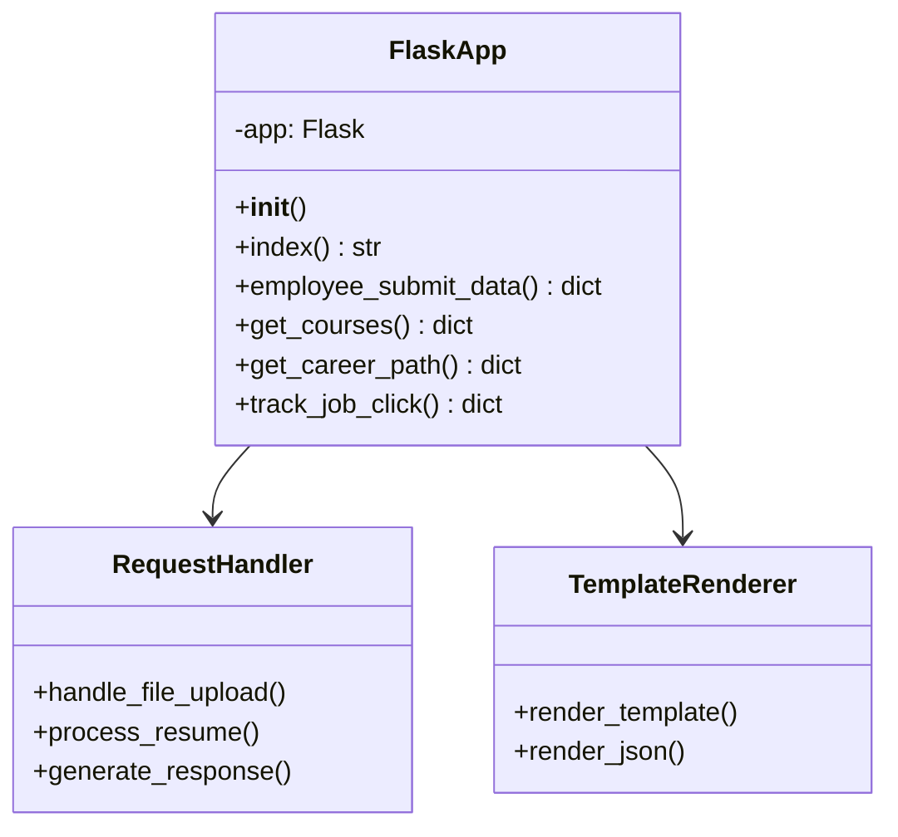
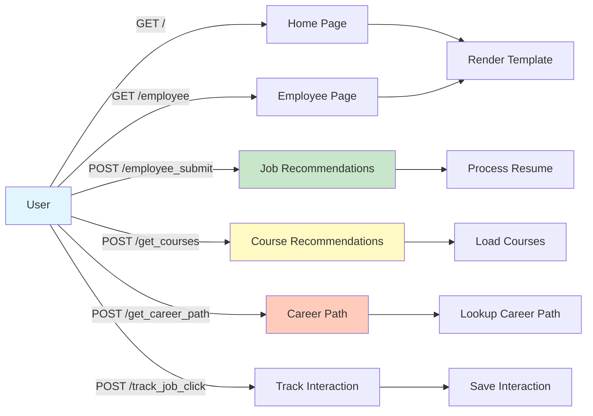
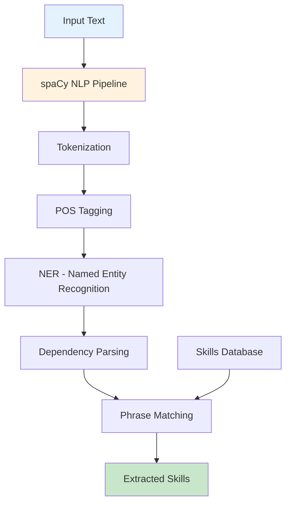
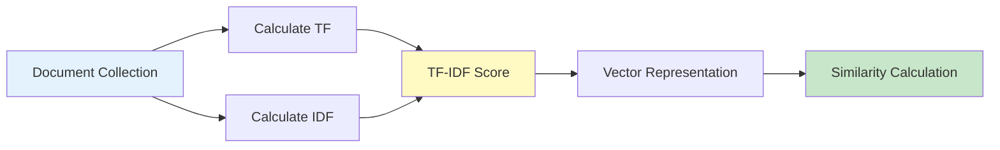
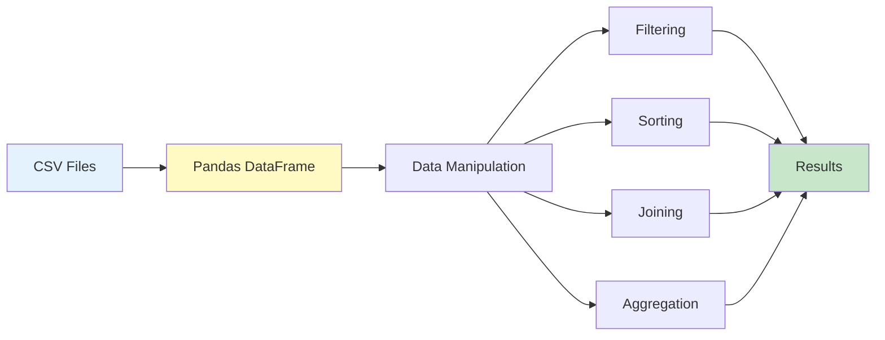
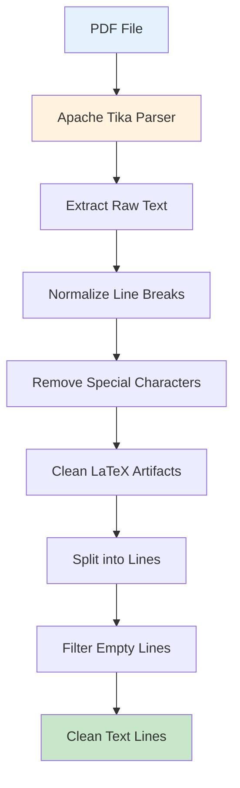

# Chapter 2: Technologies and System Architecture

## 2.1. Backend Framework: Flask

### 2.1.1. Introduction to Flask 2.1.2

Flask is a lightweight and flexible Python web framework that provides the essential tools and libraries needed to build web applications. Flask follows the WSGI (Web Server Gateway Interface) standard and is designed to be simple, extensible, and easy to learn.

**Key Characteristics:**
- **Microframework**: Flask provides core functionality without imposing dependencies, allowing developers to choose extensions as needed
- **Jinja2 Templating**: Built-in template engine for dynamic HTML generation
- **Werkzeug WSGI Toolkit**: Provides utilities for request handling, routing, and debugging
- **RESTful Support**: Easy creation of REST API endpoints

**Version Used:** Flask 2.1.2
- Released in 2022
- Includes security improvements and bug fixes
- Compatible with Python 3.7+

### 2.1.2. Why Flask was Chosen

Flask was selected for this project for several reasons:

1. **Simplicity**: Flask's minimalistic approach makes it easy to understand and maintain
2. **Flexibility**: No enforced project structure allows for custom organization
3. **Lightweight**: Minimal overhead compared to full-stack frameworks
4. **Python Integration**: Seamless integration with Python's NLP and ML libraries
5. **Template Rendering**: Built-in Jinja2 support for dynamic HTML generation
6. **Rapid Development**: Quick setup and development cycle

### 2.1.3. Flask Application Structure



The Flask application (`app.py`) follows a modular structure:

```python
from flask import Flask, render_template, request, jsonify
app = Flask(__name__)

# Configuration
app.jinja_env.globals.update(zip=zip)

# Routes
@app.route('/')
def index():
    return render_template("index.html")

@app.route('/employee_submit', methods=['POST'])
def employee_submit_data():
    # Handle resume upload and job recommendations
    pass
```

**Key Components:**

1. **Application Initialization**: `app = Flask(__name__)` creates the Flask application instance
2. **Jinja2 Globals**: `app.jinja_env.globals.update(zip=zip)` makes Python's `zip` function available in templates
3. **Route Decorators**: `@app.route()` defines URL endpoints
4. **Request Handling**: `request` object provides access to form data, files, and parameters
5. **Template Rendering**: `render_template()` renders HTML templates with data
6. **JSON Responses**: `jsonify()` returns JSON for API endpoints

### 2.1.4. Routes and Endpoints



The application defines several routes:

**Main Routes:**
- `/` - Home page
- `/employee` - Employee page for resume upload
- `/home` - Redirects to home page

**API Endpoints:**
- `/employee_submit` (POST) - Handles resume upload and returns job recommendations
- `/get_courses` (POST) - Returns course recommendations via AJAX
- `/get_career_path` (POST) - Returns career path suggestions via AJAX
- `/track_job_click` (POST) - Tracks user clicks on job applications

**Static File Serving:**
- `/static/<path>` - Serves static files (CSS, JavaScript)
- `/img/<path>` - Serves images
- `/styles/<path>` - Serves CSS files

### 2.1.5. Template Rendering with Jinja2

Jinja2 is Flask's default templating engine, allowing dynamic HTML generation:

**Template Features:**
- Variable substitution: `{{ variable }}`
- Control structures: ``, ``
- Template inheritance: ``
- Filters: `{{ variable|filter }}`

**Example Usage:**
```python
return render_template('employee.html',
                     column_names=column_names,
                     row_data=row_data,
                     link_column=link_column,
                     resume_filename=filename)
```

In the template:
```html

    <th>{{ col }}</th>

```

### 2.1.6. Code Example: app.py Structure

The main Flask application file (`app.py`) demonstrates the following patterns:

**File Upload Handling:**
```python
f = request.files['userfile']
f.save(os.path.join(app.instance_path, 'resume_files', f.filename))
```

**Hybrid Job Recommendations:**
```python
result_cosine = job.find_sort_job_hybrid(
    path, 
    use_collaborative=True, 
    collaborative_weight=0.3, 
    use_experience=True
)
```

**AJAX Response:**
```python
return jsonify({
    'success': True,
    'column_names': course_column_names,
    'row_data': course_row_data
})
```

**Error Handling:**
```python
try:
    # Process request
except Exception as e:
    return jsonify({
        'success': False,
        'error': str(e)
    }), 500
```

---

## 2.2. Natural Language Processing

### 2.2.1. spaCy Framework



**Introduction to spaCy:**

spaCy is an industrial-strength Natural Language Processing library for Python. It provides pre-trained models for various NLP tasks and is designed for production use with high performance.

**Key Features:**
- Fast and efficient processing
- Pre-trained models for multiple languages
- Tokenization, POS tagging, NER, and dependency parsing
- Phrase matching capabilities
- Easy integration with machine learning pipelines

**Model Used:** `en_core_web_sm`
- Small English model (20MB)
- Includes word vectors, POS tagger, parser, NER, and entity linker
- Suitable for most NLP tasks while maintaining good performance

**Installation:**
```bash
python -m spacy download en_core_web_sm
```

**Usage in Project:**
```python
import spacy
from spacy.matcher import PhraseMatcher

nlp = spacy.load('en_core_web_sm')
```

**Tokenization and POS Tagging:**
spaCy automatically tokenizes text and assigns part-of-speech tags:

```python
doc = nlp("Python programming and machine learning")
for token in doc:
    print(token.text, token.pos_)
# Output: Python PROPN, programming NOUN, and CCONJ, machine NOUN, learning NOUN
```

**Named Entity Recognition (NER):**
Identifies entities such as organizations, locations, and skills:

```python
doc = nlp("Worked at Google as a Software Engineer")
for ent in doc.ents:
    print(ent.text, ent.label_)
# Output: Google ORG, Software Engineer PERSON
```

**Phrase Matching:**
spaCy's PhraseMatcher is used for skill extraction:

```python
from spacy.matcher import PhraseMatcher

matcher = PhraseMatcher(nlp.vocab)
patterns = [nlp.make_doc(text) for text in skills_list]
matcher.add("Skills", None, *patterns)

matches = matcher(nlp(resume_text))
for match_id, start, end in matches:
    skill = doc[start:end].text
```

### 2.2.2. NLTK Library

**Introduction to NLTK 3.7:**

The Natural Language Toolkit (NLTK) is a comprehensive library for symbolic and statistical natural language processing. It provides easy-to-use interfaces to over 50 corpora and lexical resources.

**Key Features:**
- Text preprocessing utilities
- Stopword lists for multiple languages
- Tokenization and stemming
- Part-of-speech tagging
- Named entity recognition
- Corpus access

**Corpora Used:**

1. **punkt**: Sentence tokenizer
   ```python
   nltk.download('punkt')
   ```

2. **stopwords**: Stopword lists
   ```python
   from nltk.corpus import stopwords
   stopw = set(stopwords.words('english'))
   ```

3. **wordnet**: Lexical database
   ```python
   nltk.download('wordnet')
   ```

4. **brown**: Brown corpus for training
   ```python
   nltk.download('brown')
   ```

**Text Preprocessing Functions:**

**Stopwords Removal:**
```python
from nltk.corpus import stopwords
stopw = set(stopwords.words('english'))

filtered_text = ' '.join([word for word in text.split() 
                         if word not in stopw])
```

**Tokenization:**
```python
from nltk.tokenize import word_tokenize
tokens = word_tokenize(text)
```

**POS Tagging:**
```python
from nltk import pos_tag
tagged = pos_tag(tokens)
```

**Usage in Project:**
NLTK is primarily used for:
- Stopword removal in job descriptions
- Text preprocessing before TF-IDF vectorization
- Tokenization for skill extraction

---

## 2.3. Machine Learning with scikit-learn

### 2.3.1. Introduction to scikit-learn 1.1.1

scikit-learn is a free machine learning library for Python. It provides simple and efficient tools for data mining and data analysis, built on NumPy, SciPy, and matplotlib.

**Key Features:**
- Supervised and unsupervised learning algorithms
- Model selection and evaluation tools
- Data preprocessing utilities
- Dimensionality reduction
- Clustering algorithms

**Version Used:** scikit-learn 1.1.1
- Released in 2022
- Includes performance improvements and bug fixes
- Compatible with Python 3.8+

### 2.3.2. TF-IDF Vectorization



**Term Frequency-Inverse Document Frequency (TF-IDF)** is a numerical statistic that reflects how important a word is to a document in a collection of documents.

**Mathematical Foundation:**

1. **Term Frequency (TF):**
   ```
   TF(t, d) = (Number of times term t appears in document d) / (Total number of terms in d)
   ```

2. **Inverse Document Frequency (IDF):**
   ```
   IDF(t, D) = log(Total number of documents / Number of documents containing term t)
   ```

3. **TF-IDF Score:**
   ```
   TF-IDF(t, d, D) = TF(t, d) × IDF(t, D)
   ```

**Implementation with scikit-learn:**

**TfidfVectorizer:**
```python
from sklearn.feature_extraction.text import TfidfVectorizer

vectorizer = TfidfVectorizer(min_df=1, analyzer=ngrams, lowercase=False)
tfidf_matrix = vectorizer.fit_transform(documents)
```

**CountVectorizer:**
Used for simpler bag-of-words representation:
```python
from sklearn.feature_extraction.text import CountVectorizer

cv = CountVectorizer()
count_matrix = cv.fit_transform([skills, job_description])
```

**Advantages:**
- Reduces importance of common words
- Highlights distinctive terms
- Works well for text similarity

**Limitations:**
- Does not capture semantic meaning
- Order of words is lost
- May not work well for very short texts

### 2.3.3. Cosine Similarity

```mermaid
graph TB
    subgraph "Vector Space"
        A[Resume Vector<br/>TF-IDF]
        B[Job Description Vector<br/>TF-IDF]
    end
    
    C[Calculate Dot Product] --> D[Calculate Magnitudes]
    D --> E[Cosine Similarity<br/>cos θ = A·B / ||A|| ||B||]
    E --> F[Match Percentage<br/>0-100%]
    
    A --> C
    B --> C
    
    style A fill:#e3f2fd
    style B fill:#fff3e0
    style F fill:#c8e6c9
```

**Mathematical Formula:**

Cosine similarity measures the cosine of the angle between two non-zero vectors:

```
similarity = cos(θ) = (A · B) / (||A|| × ||B||)
```

Where:
- A · B is the dot product of vectors A and B
- ||A|| and ||B|| are the magnitudes (norms) of vectors A and B

**Geometric Interpretation:**

Cosine similarity ranges from -1 to 1:
- **1**: Vectors point in the same direction (identical)
- **0**: Vectors are orthogonal (no similarity)
- **-1**: Vectors point in opposite directions (opposite)

For TF-IDF vectors (which are non-negative), cosine similarity ranges from 0 to 1.

**Application in Job Matching:**

```python
from sklearn.metrics.pairwise import cosine_similarity

# Calculate similarity between resume skills and job description
similarity_score = cosine_similarity(resume_vector, job_vector)[0][1]
match_percentage = similarity_score * 100
```

**Why Cosine Similarity:**
- Normalized by vector magnitude (handles different document lengths)
- Efficient computation
- Works well with sparse vectors (TF-IDF)
- Interpretable results (0-1 scale)

### 2.3.4. Nearest Neighbors

Used in collaborative filtering for finding similar users:

```python
from sklearn.neighbors import NearestNeighbors

nbrs = NearestNeighbors(n_neighbors=k, metric='cosine')
nbrs.fit(user_matrix)
distances, indices = nbrs.kneighbors(query_user)
```

---

## 2.4. Data Processing Libraries

### 2.4.1. Pandas 1.4.2



**Introduction:**

Pandas is a fast, powerful, flexible, and easy-to-use open-source data analysis and manipulation library built on top of Python.

**Key Features:**
- DataFrame and Series data structures
- Data cleaning and transformation
- CSV file reading and writing
- Data filtering and selection
- Grouping and aggregation

**Usage in Project:**

**Reading CSV Files:**
```python
import pandas as pd

jobs_df = pd.read_csv('indeed_data.csv')
courses_df = pd.read_csv('course dataset/Coursera.csv')
```

**Data Manipulation:**
```python
# Filter duplicates
df = jobs_df.drop_duplicates(subset='description')

# Select columns
result = df[['title', 'company', 'link']]

# Join dataframes
result = result.join(match_percentage_df)

# Sort values
result = result.sort_values('Skills Match', ascending=False)

# Head operation
result = result.head(20)
```

**DataFrame Operations:**
```python
# Apply function to column
df['clean'] = df['description'].apply(preprocessing_function)

# Convert to list
column_names = df.columns.values.tolist()
row_data = df.values.tolist()
```

### 2.4.2. NumPy 1.22.4

**Introduction:**

NumPy is the fundamental package for scientific computing in Python. It provides a powerful N-dimensional array object and tools for working with these arrays.

**Usage in Project:**

**Array Operations:**
```python
import numpy as np

# Create matrix
matrix = np.zeros((num_users, num_jobs))

# Array operations
similarity_matrix = cosine_similarity(user_matrix)
```

**Numerical Computations:**
NumPy is used internally by scikit-learn and pandas for efficient numerical operations.

---

## 2.5. File Processing: Apache Tika

### 2.5.1. Introduction to Apache Tika

Apache Tika is a content analysis toolkit that detects and extracts metadata and structured text content from various documents using existing parser libraries.

**Key Features:**
- Supports multiple file formats (PDF, DOCX, DOC, etc.)
- Extracts text content and metadata
- Handles various encodings
- Robust parsing with error handling

**Installation:**
```bash
pip install tika
```

### 2.5.2. PDF Parsing



**Implementation:**
```python
from tika import parser

def convert_pdf_to_txt(pdf_file):
    raw_text = parser.from_file(pdf_file, service='text')['content']
    # Clean and process text
    full_string = re.sub(r'\n+', '\n', raw_text)
    full_string = full_string.replace("\r", "\n")
    full_string = full_string.replace("\t", " ")
    
    # Remove LaTeX characters
    full_string = re.sub(r"\uf0b7", " ", full_string)
    full_string = re.sub(r"\(cid:\d{0,2}\)", " ", full_string)
    
    # Split into lines
    resume_lines = full_string.splitlines(True)
    resume_lines = [re.sub(r'\s+', ' ', line.strip()) 
                   for line in resume_lines if line.strip()]
    return resume_lines
```

**Features:**
- Handles various PDF formats
- Extracts text while preserving structure
- Cleans special characters
- Returns list of lines for further processing

### 2.5.3. DOCX Parsing

**Implementation:**
```python
def convert_docx_to_txt(docx_file):
    text = parser.from_file(docx_file, service='text')['content']
    clean_text = re.sub(r'\n+', '\n', text)
    clean_text = clean_text.replace("\r", "\n").replace("\t", " ")
    resume_lines = clean_text.splitlines()
    resume_lines = [re.sub(r'\s+', ' ', line.strip()) 
                   for line in resume_lines if line.strip()]
    return resume_lines
```

**Features:**
- Extracts text from DOCX files
- Normalizes line breaks and whitespace
- Returns clean list of text lines

### 2.5.4. Text Extraction and Cleaning

**Text Cleaning Process:**

1. **Normalize whitespace**: Replace multiple spaces/newlines with single characters
2. **Remove special characters**: Clean LaTeX and encoding artifacts
3. **Split into lines**: Preserve document structure
4. **Filter empty lines**: Remove blank entries

**Error Handling:**
```python
try:
    text = parser.from_file(file_path, service='text')['content']
except Exception as e:
    print(f"Error parsing file: {e}")
    return []
```

---

## 2.6. Frontend Technologies

### 2.6.1. HTML5 and Jinja2 Templates

**HTML5 Structure:**
- Semantic HTML elements
- Form handling for file uploads
- Table structures for displaying results

**Jinja2 Templating:**
- Dynamic content generation
- Template inheritance
- Variable substitution
- Control structures (loops, conditionals)

**Example Template:**
```html

<tr>
    
        
            <td><a href="{{ value }}" target="_blank">Apply</a></td>
        
            <td>{{ value }}</td>
        
    
</tr>

```

### 2.6.2. CSS3 for Styling

**Features Used:**
- Responsive design
- Table styling with sticky headers
- Custom scrollbars
- Color coding for recommendations
- Modern UI elements

**Key CSS Classes:**
- `.table-container`: Scrollable table wrapper
- `.job-link`: Styled job application links
- Color classes for course types (missing skills vs. advanced)

### 2.6.3. JavaScript for Dynamic Content

**AJAX Implementation:**
```javascript
fetch('/get_courses', {
    method: 'POST',
    body: formData
})
.then(response => response.json())
.then(data => {
    if (data.success) {
        buildCourseTable(data.column_names, data.row_data);
    }
});
```

**Features:**
- Asynchronous course loading
- Dynamic table building
- Job click tracking
- Error handling

---

## Summary

This chapter detailed all the technologies, frameworks, and libraries used in the system. Flask provides the web framework foundation, while spaCy and NLTK handle NLP tasks. scikit-learn provides machine learning algorithms, and Pandas/NumPy handle data processing. Apache Tika enables document parsing, and HTML/CSS/JavaScript create the user interface. The next chapter will describe how these technologies are integrated into functional modules.

