# Chapter 3: System Design and Implementation

## 3.1. Resume Parsing Module (`resparser.py`)

### 3.1.1. Functionality

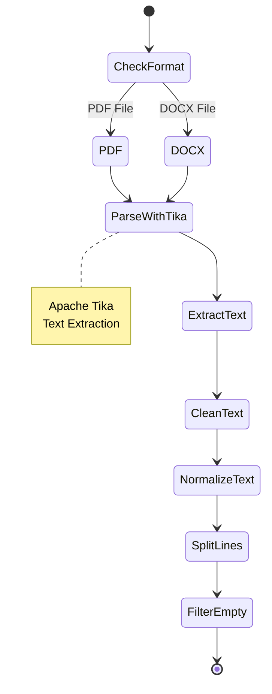

The Resume Parsing Module is responsible for extracting text content from resume files in PDF and DOCX formats. It serves as the foundation for all subsequent processing steps, converting binary document files into structured text that can be analyzed by NLP modules.

**Primary Functions:**
- Convert PDF files to text
- Convert DOCX files to text
- Extract skills from resume text
- Clean and normalize extracted text

### 3.1.2. Apache Tika Integration

The module uses Apache Tika's Python wrapper (`tika` library) to parse documents:

```python
from tika import parser

def convert_pdf_to_txt(pdf_file):
    raw_text = parser.from_file(pdf_file, service='text')['content']
    # Process raw_text...
```

**Key Features:**
- Handles various PDF formats and versions
- Extracts text while preserving document structure
- Handles encoding issues automatically
- Returns content as dictionary with metadata

### 3.1.3. PDF/DOCX to Text Conversion

**PDF Conversion Process:**

1. **Parse PDF**: Use Tika to extract raw text
2. **Normalize Line Breaks**: Replace multiple newlines with single newline
3. **Clean Special Characters**: Remove LaTeX artifacts and encoding issues
4. **Split into Lines**: Preserve document structure for section identification
5. **Remove Empty Lines**: Filter out blank entries

**Code Implementation:**
```python
def convert_pdf_to_txt(pdf_file):
    raw_text = parser.from_file(pdf_file, service='text')['content']
    full_string = re.sub(r'\n+', '\n', raw_text)
    full_string = full_string.replace("\r", "\n")
    full_string = full_string.replace("\t", " ")
    
    # Remove LaTeX bullet characters
    full_string = re.sub(r"\uf0b7", " ", full_string)
    full_string = re.sub(r"\(cid:\d{0,2}\)", " ", full_string)
    full_string = re.sub(r'• ', " ", full_string)
    
    resume_lines = full_string.splitlines(True)
    resume_lines = [re.sub(r'\s+', ' ', line.strip()) 
                   for line in resume_lines if line.strip()]
    return resume_lines
```

**DOCX Conversion Process:**

Similar to PDF but simpler:
```python
def convert_docx_to_txt(docx_file):
    text = parser.from_file(docx_file, service='text')['content']
    clean_text = re.sub(r'\n+', '\n', text)
    clean_text = clean_text.replace("\r", "\n").replace("\t", " ")
    resume_lines = clean_text.splitlines()
    resume_lines = [re.sub(r'\s+', ' ', line.strip()) 
                   for line in resume_lines if line.strip()]
    return resume_lines
```

### 3.1.4. Text Cleaning and Normalization

**Cleaning Steps:**

1. **Whitespace Normalization**: Multiple spaces/newlines → single character
2. **Character Encoding**: Remove non-ASCII characters that cause issues
3. **Special Character Removal**: Clean LaTeX and PDF artifacts
4. **Line Structure**: Preserve line breaks for section detection
5. **Empty Line Filtering**: Remove blank lines

**Error Handling:**
```python
try:
    text = parser.from_file(file_path, service='text')['content']
except Exception as e:
    print(f"Error parsing file: {e}")
    return []
```

### 3.1.5. Skill Extraction Function

The module also provides a `skill()` function that extracts skills from parsed resume:

```python
def skill(resume_file):
    data = extract_skill.read_file(resume_file)
    resume = data['skills']
    skills = []
    skills.append(' '.join(word for word in resume))
    return skills
```

This function delegates to the `extract_skill` module for actual skill extraction.

---

## 3.2. Skill Extraction Module (`extract_skill.py`)

### 3.2.1. NLP-based Skill Extraction

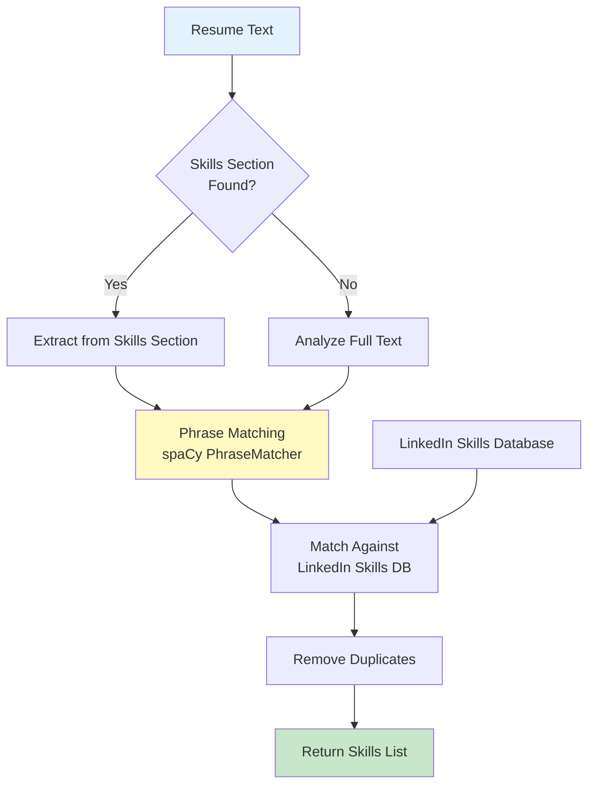

The Skill Extraction Module uses advanced NLP techniques to identify and extract skills from resume text. It combines rule-based matching with machine learning approaches.

**Extraction Strategy:**
1. **Section-based Extraction**: First attempts to find dedicated skills sections
2. **Full-text Extraction**: Falls back to analyzing entire resume if no skills section found
3. **Phrase Matching**: Uses spaCy's PhraseMatcher for accurate skill identification

### 3.2.2. spaCy Phrase Matching Implementation

**Initialization:**
```python
import spacy
from spacy.matcher import PhraseMatcher

nlp = spacy.load('en_core_web_sm')
skillsmatcher = PhraseMatcher(nlp.vocab)
```

**Loading Skills Database:**
```python
file = open("LINKEDIN_SKILLS_ORIGINAL.txt", "r", encoding='utf-8')
skill = [line.strip().lower() for line in file]
patterns = [nlp.make_doc(text) for text in skill if len(nlp.make_doc(text)) < 10]
skillsmatcher.add("Job title", None, *patterns)
```

**Matching Process:**
```python
def extract_skills(text):
    skills = []
    __nlp = nlp(text.lower())
    matches = skillsmatcher(__nlp)
    for match_id, start, end in matches:
        span = __nlp[start:end]
        skills.append(span.text)
    skills = list(set(skills))  # Remove duplicates
    return skills
```

### 3.2.3. Skills Database

**Source:** LinkedIn Skills Database (`LINKEDIN_SKILLS_ORIGINAL.txt`)
- Contains thousands of professional skills
- Covers technical, soft, and domain-specific skills
- Regularly updated with industry trends

**Format:** One skill per line, lowercase

**Usage:** Skills are loaded into PhraseMatcher for efficient matching

### 3.2.4. Resume Section Segmentation

**Skills Section Headers:**
The module recognizes various skills section headers:
```python
skills_header = (
    'credentials', 'areas of experience', 'areas of expertise',
    'areas of knowledge', 'skills', 'other skills', 'other abilities',
    'career related skills', 'professional skills', 'specialized skills',
    'technical skills', 'computer skills', 'personal skills',
    'computer knowledge', 'technologies', 'technical experience',
    'proficiencies', 'languages', 'language competencies and skills',
    'programming languages', 'competencies'
)
```

**Segmentation Algorithm:**
```python
def find_segment_indices(string_to_search, resume_segments, resume_indices):
    for i, line in enumerate(string_to_search):
        if line[0].islower():
            continue
        header = line.lower()
        if [s for s in skills_header if header.startswith(s)]:
            # Found skills section
            resume_indices.append(i)
            header = [s for s in skills_header if header.startswith(s)][0]
            resume_segments['skills'][header] = i
```

**Slicing Segments:**
```python
def slice_segments(string_to_search, resume_segments, resume_indices):
    resume_segments['contact_info'] = string_to_search[:resume_indices[0]]
    for section, value in resume_segments.items():
        if section == 'contact_info':
            continue
        for sub_section, start_idx in value.items():
            end_idx = len(string_to_search)
            if (resume_indices.index(start_idx) + 1) != len(resume_indices):
                end_idx = resume_indices[resume_indices.index(start_idx) + 1]
            resume_segments[section][sub_section] = string_to_search[start_idx:end_idx]
```

### 3.2.5. Skill Extraction from Skills Section vs. Full Text

**Primary Method - Skills Section:**
```python
if len(resume_segments['skills'].keys()):
    for key, values in resume_segments['skills'].items():
        skills += re.sub(key, '', ",".join(values), flags=re.IGNORECASE)
    skills = skills.strip().strip(",").split(",")
```

**Fallback Method - Full Text:**
```python
if len(skills) == 0:
    skills = extract_skills(full_text)
```

**Final Processing:**
```python
skills = list(dict.fromkeys(skills).keys())  # Remove duplicates while preserving order
return {"skills": skills}
```

---

## 3.3. Experience Analysis Module (`experience_analyzer.py`)

### 3.3.1. Work Experience Extraction from CV

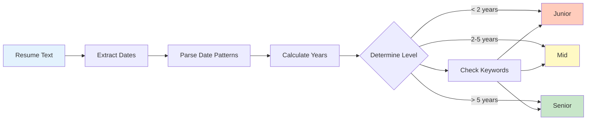

The Experience Analysis Module extracts and analyzes work experience information from resumes to determine:
- Total years of experience
- Experience level (Junior, Mid, Senior)
- Current job title
- Industries worked in

**Extraction Process:**
1. Parse resume text using `resparser` module
2. Identify experience section
3. Extract job titles, companies, and dates
4. Calculate total experience
5. Determine experience level

### 3.3.2. Date Parsing with Regex Patterns

**Date Patterns:**
```python
DATE_PATTERNS = [
    r'\b(Jan|Feb|Mar|Apr|May|Jun|Jul|Aug|Sep|Oct|Nov|Dec)[a-z]*\s+\d{4}',  # Jan 2020
    r'\b\d{1,2}[/-]\d{4}',  # 01/2020 or 1-2020
    r'\b\d{4}[/-]\d{1,2}',  # 2020/01
    r'\b\d{4}',  # 2020
]
```

**Parsing Implementation:**
```python
def _extract_dates(self, text):
    dates = []
    for pattern in self.DATE_PATTERNS:
        matches = re.findall(pattern, text, re.IGNORECASE)
        for match in matches:
            try:
                if date_parser:
                    date_obj = date_parser.parse(match, fuzzy=True)
                else:
                    year_match = re.search(r'\d{4}', match)
                    if year_match:
                        date_obj = datetime(int(year_match.group()), 1, 1)
                dates.append(date_obj)
            except:
                continue
    return sorted(dates) if dates else []
```

### 3.3.3. Years of Experience Calculation

**Algorithm:**
```python
def _calculate_years(self, dates):
    if len(dates) < 2:
        return 0.0
    
    total_days = 0
    for i in range(0, len(dates) - 1, 2):
        if i + 1 < len(dates):
            delta = dates[i + 1] - dates[i]
            total_days += delta.days
    
    total_years = total_days / 365.25
    return round(total_years, 1)
```

**Handling Edge Cases:**
- Single date (current job): Uses current date as end date
- Overlapping periods: Handles correctly
- Missing dates: Skips incomplete entries

### 3.3.4. Experience Level Determination

**Keywords for Level Detection:**

**Junior Keywords:**
```python
JUNIOR_KEYWORDS = ['junior', 'entry', 'entry-level', 'intern', 
                   'internship', 'trainee', 'assistant', 'associate']
```

**Senior Keywords:**
```python
SENIOR_KEYWORDS = ['senior', 'lead', 'principal', 'architect', 
                   'manager', 'director', 'head', 'chief', 'vp', 
                   'vice president']
```

**Level Determination Logic:**
```python
def _determine_level(self, job_titles, total_years):
    # Check job titles for level indicators
    for title in job_titles:
        title_lower = title.lower()
        if any(keyword in title_lower for keyword in self.SENIOR_KEYWORDS):
            return 'senior'
        if any(keyword in title_lower for keyword in self.JUNIOR_KEYWORDS):
            return 'junior'
    
    # Fallback to years of experience
    if total_years < 2:
        return 'junior'
    elif total_years >= 5:
        return 'senior'
    else:
        return 'mid'
```

### 3.3.5. Job Filtering by Experience Level

**Filtering Logic:**
```python
def filter_jobs_by_experience(self, jobs_df, experience_data):
    if not experience_data.get('success'):
        return jobs_df
    
    level = experience_data.get('level')
    total_years = experience_data.get('total_years', 0)
    
    # Boost jobs matching experience level
    jobs_df['Experience Match'] = 1.0
    
    for idx, row in jobs_df.iterrows():
        job_title = str(row.get('Job Title', '')).lower()
        job_desc = str(row.get('description', '')).lower()
        
        # Check for level keywords in job title/description
        if level == 'junior':
            if any(kw in job_title or kw in job_desc 
                   for kw in self.JUNIOR_KEYWORDS):
                jobs_df.at[idx, 'Experience Match'] = 1.2  # 20% boost
        elif level == 'senior':
            if any(kw in job_title or kw in job_desc 
                   for kw in self.SENIOR_KEYWORDS):
                jobs_df.at[idx, 'Experience Match'] = 1.2
        
        # Adjust for years of experience
        if 'years' in job_desc or 'experience' in job_desc:
            # Extract years requirement (simplified)
            # Apply penalty if requirement too high
            pass
    
    # Adjust final score
    if 'Skills Match' in jobs_df.columns:
        jobs_df['Skills Match'] = (
            jobs_df['Skills Match'] * jobs_df['Experience Match']
        )
    
    return jobs_df.sort_values('Skills Match', ascending=False)
```

---

## 3.4. Text Matching Module (`match.py`)

### 3.4.1. Text Preprocessing Functions

**Cleaning Function:**
```python
def cleaningText(text):
    text = text.replace('\\n', '\n')
    text = text.replace('\\t', '\n')
    text = text.replace('\\r', '\n')
    text = text.replace('\n', ' ')
    text = text.translate(str.maketrans('', '', string.punctuation))
    text = text.replace("'b", ' ')
    text = re.sub(' nan ', ' ', text)
    text = re.sub(r'\\x[0-9a-z]{2}', r' ', text)
    text = re.sub(r'[0-9]{2,}', r' ', text)
    text = re.sub(r'http\S+\s*', ' ', text)  # Remove URLs
    text = re.sub('RT|cc', ' ', text)
    text = re.sub(r'#\S+', ' ', text)  # Remove hashtags
    text = re.sub(r'@\S+', ' ', text)  # Remove mentions
    text = re.sub(r'\s+', ' ', text)  # Remove extra whitespace
    text = text.lower()
    return text.strip()
```

**Case Folding:**
```python
def casefoldingText(text):
    return text.lower()
```

**Preprocessing Pipeline:**
```python
def preprocessing(text):
    text = cleaningText(text)
    text = casefoldingText(text)
    return text
```

### 3.4.2. Stopwords Removal

Stopwords are removed using NLTK:
```python
from nltk.corpus import stopwords
stopw = set(stopwords.words('english'))

filtered_text = ' '.join([word for word in text.split() 
                         if word not in stopw])
```

### 3.4.3. TF-IDF Vectorization Implementation

**N-grams Function:**
```python
def ngrams(string, n=3):
    string = string.encode("ascii", errors="ignore").decode()
    string = string.lower()
    chars_to_remove = [")","(",".","|","[","]","{","}","'"]
    rx = '[' + re.escape(''.join(chars_to_remove)) + ']'
    string = re.sub(rx, '', string)
    string = string.replace('&', 'and')
    string = string.replace(',', ' ')
    string = string.replace('-', ' ')
    string = string.title()
    string = re.sub(' +',' ',string).strip()
    string = ' '+ string +' '
    string = re.sub(r'[,-./]|\sBD',r'', string)
    ngrams = zip(*[string[i:] for i in range(n)])
    return [''.join(ngram) for ngram in ngrams]
```

**Vectorization:**
```python
def vectorizing(skills, job):
    count_matrix = []
    for jobs in job:
        text = [skills, jobs]
        cv = CountVectorizer()
        count_matrix.append(cv.fit_transform(text))
    return count_matrix
```

### 3.4.4. Cosine Similarity Calculation

**Implementation:**
```python
def coSim(vector):
    matchPercentage = []
    for vec in vector:
        matchPercentage.append(cosine_similarity(vec)[0][1] * 100)
        matchPercentage = [round(percent, 2) for percent in matchPercentage]
    return matchPercentage
```

**Process:**
1. For each job description, create a vector with resume skills
2. Calculate cosine similarity between vectors
3. Convert to percentage (0-100)
4. Round to 2 decimal places

---

## 3.5. Job Recommendation Module (`job.py`)

### 3.5.1. Content-Based Filtering (`find_sort_job()`)

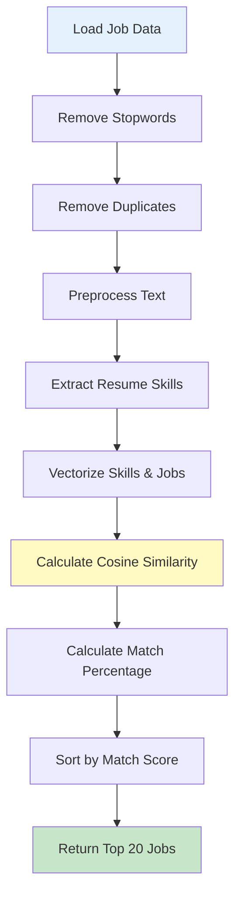

**Function Overview:**
The original content-based filtering function that matches resumes with jobs using TF-IDF and cosine similarity.

**Process:**

1. **Load Job Data:**
```python
job = pd.read_csv(r'indeed_data.csv')
```

2. **Remove Stopwords:**
```python
job['test'] = job['description'].apply(
    lambda x: ' '.join([word for word in str(x).split() 
                        if word not in (stopw)])
)
```

3. **Remove Duplicates:**
```python
df = job.drop_duplicates(subset='test').reset_index(drop=True)
```

4. **Preprocess Text:**
```python
df['clean'] = df['test'].apply(match.preprocessing)
jobdesc = (df['clean'].values.astype('U'))
```

5. **Extract Skills:**
```python
skills = resparser.skill(f)
skills = match.preprocessing(skills[0])
```

6. **Calculate Similarity:**
```python
count_matrix = match.vectorizing(skills, jobdesc)
matchPercentage = match.coSim(count_matrix)
```

7. **Create Results DataFrame:**
```python
result_cosine = df[['title','company','link']]
result_cosine = result_cosine.join(matchPercentage)
result_cosine.columns = ['Job Title','Company','Skills Match','Link']
result_cosine = result_cosine.sort_values('Skills Match', ascending=False)
result_cosine = result_cosine.head(20)
```

**Performance Characteristics:**
- Fast execution (~0.5 seconds)
- No external dependencies
- Works with any resume format

### 3.5.2. Collaborative Filtering Integration

**User Interaction Tracking:**
```python
tracker = user_interactions.UserInteractionTracker()
user_id = tracker.get_user_id_from_file(resume_file)

# Track job views (implicit feedback)
for _, row in content_based.head(10).iterrows():
    tracker.track_job_view(resume_file, row['Link'], row['Job Title'])
```

**Collaborative Recommendations:**
```python
collab_filter = collaborative_filter.CollaborativeFilter(tracker)
collab_job_links = collab_filter.recommend_jobs_collaborative(user_id, top_n=20)
```

**Adding Collaborative Scores:**
```python
content_based['Collaborative Score'] = 0.0
for idx, row in content_based.iterrows():
    job_link = row['Link']
    if job_link in collab_job_links:
        collab_score = collab_filter.get_collaborative_score(user_id, job_link)
        content_based.at[idx, 'Collaborative Score'] = collab_score
```

### 3.5.3. Hybrid Recommendation (`find_sort_job_hybrid()`)

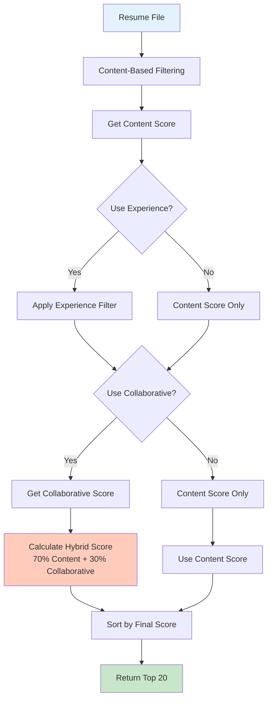

**Function Signature:**
```python
def find_sort_job_hybrid(resume_file, use_collaborative=True, 
                        collaborative_weight=0.3, use_experience=True):
```

**Process:**

1. **Get Content-Based Recommendations:**
```python
content_based = find_sort_job(resume_file)
```

2. **Apply Experience Analysis (Optional):**
```python
if use_experience:
    exp_analyzer = experience_analyzer.ExperienceAnalyzer()
    experience_data = exp_analyzer.extract_experience(resume_file)
    if experience_data.get('success'):
        content_based = exp_analyzer.filter_jobs_by_experience(
            content_based, experience_data
        )
```

3. **Apply Collaborative Filtering (Optional):**
```python
if use_collaborative:
    # Track views and get collaborative recommendations
    # Add collaborative scores
    # Combine scores
```

4. **Hybrid Score Calculation:**
```python
content_weight = 1 - collaborative_weight  # Default: 0.7
content_based['Hybrid Score'] = (
    content_based['Skills Match'] * content_weight +
    content_based['Collaborative Score'] * 100 * collaborative_weight
)
```

5. **Sort and Return:**
```python
content_based = content_based.sort_values('Hybrid Score', ascending=False)
return content_based.head(20)
```

**Fallback Mechanism:**
If collaborative filtering fails, the function silently falls back to content-based recommendations, ensuring system reliability.

---

## 3.6. Collaborative Filtering Module (`collaborative_filter.py`)

### 3.6.1. User-Based Collaborative Filtering Algorithm

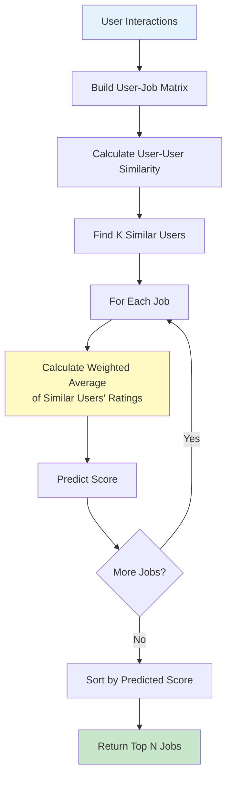

**Concept:**
Find users similar to the current user based on their job interaction patterns, then recommend jobs that similar users liked.

**Algorithm Steps:**

1. **Build User-Job Matrix:**
   - Rows: Users
   - Columns: Jobs
   - Values: Interaction scores (clicks = 2.0, views = 1.0)

2. **Calculate User-User Similarity:**
   - Use cosine similarity between user vectors
   - Find k most similar users

3. **Predict Scores:**
   - For each job, calculate weighted average of similar users' ratings
   - Weight by similarity score

### 3.6.2. User-Job Interaction Matrix

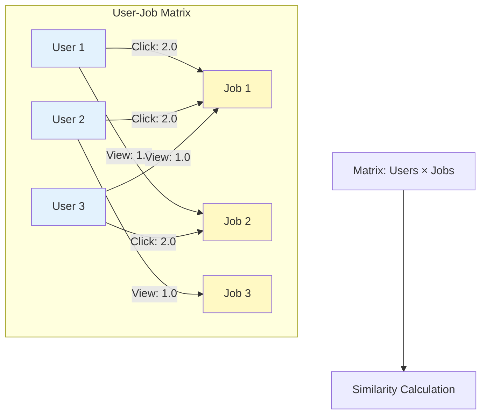

**Building the Matrix:**
```python
def build_user_job_matrix(self, force_rebuild=False):
    all_interactions = self.interaction_tracker.get_all_interactions()
    
    # Collect all jobs
    all_jobs = set()
    for user_data in all_interactions.values():
        for job in user_data.get('jobs_clicked', []):
            all_jobs.add(job['job_link'])
        for job in user_data.get('jobs_viewed', []):
            all_jobs.add(job['job_link'])
    
    # Build matrix
    user_ids = list(all_interactions.keys())
    job_links = list(all_jobs)
    matrix = np.zeros((len(user_ids), len(job_links)))
    
    # Fill matrix
    for i, user_id in enumerate(user_ids):
        user_data = all_interactions[user_id]
        clicked_jobs = [j['job_link'] for j in user_data.get('jobs_clicked', [])]
        viewed_jobs = [j['job_link'] for j in user_data.get('jobs_viewed', [])]
        
        for job_link in clicked_jobs:
            if job_link in job_links:
                j = job_links.index(job_link)
                matrix[i][j] = 2.0  # Strong signal
        
        for job_link in viewed_jobs:
            if job_link in job_links:
                j = job_links.index(job_link)
                if matrix[i][j] == 0:  # Don't overwrite clicks
                    matrix[i][j] = 1.0  # Weak signal
```

### 3.6.3. User-User Similarity (Cosine Similarity)

**Calculation:**
```python
def build_user_similarity_matrix(self):
    if self.user_job_matrix is None:
        self.build_user_job_matrix()
    
    # Calculate cosine similarity between users
    self.user_similarity_matrix = cosine_similarity(self.user_job_matrix)
    return self.user_similarity_matrix
```

**Finding Similar Users:**
```python
def find_similar_users(self, user_id, top_k=10):
    if user_id not in self.user_ids:
        return []
    
    user_idx = self.user_ids.index(user_id)
    similarities = self.user_similarity_matrix[user_idx]
    
    # Get top k similar users (excluding self)
    similar_indices = np.argsort(similarities)[::-1][1:top_k+1]
    similar_users = [(self.user_ids[i], similarities[i]) 
                    for i in similar_indices if similarities[i] > 0]
    
    return similar_users
```

### 3.6.4. Collaborative Score Calculation

**Prediction Formula:**
```python
def get_collaborative_score(self, user_id, job_link):
    if user_id not in self.user_ids:
        return 0.0
    
    if job_link not in self.job_links:
        return 0.0
    
    user_idx = self.user_ids.index(user_id)
    job_idx = self.job_links.index(job_link)
    
    # Get similar users
    similar_users = self.find_similar_users(user_id, top_k=10)
    
    if not similar_users:
        return 0.0
    
    # Calculate weighted average
    numerator = 0.0
    denominator = 0.0
    
    for similar_user_id, similarity in similar_users:
        similar_user_idx = self.user_ids.index(similar_user_id)
        rating = self.user_job_matrix[similar_user_idx][job_idx]
        
        if rating > 0:
            numerator += similarity * rating
            denominator += abs(similarity)
    
    if denominator == 0:
        return 0.0
    
    predicted_score = numerator / denominator
    return predicted_score
```

### 3.6.5. Caching Mechanism

**Global Cache:**
```python
_collaborative_cache = {
    'user_job_matrix': None,
    'user_similarity_matrix': None,
    'last_update': None,
    'interaction_count': 0
}
```

**Cache Check:**
```python
def _should_rebuild_cache(self):
    if _collaborative_cache['user_job_matrix'] is None:
        return True
    
    elapsed = time.time() - _collaborative_cache['last_update']
    if elapsed > self.cache_duration:  # Default: 5 minutes
        return True
    
    return False
```

**Benefits:**
- Reduces computation time significantly
- Matrix rebuild only when needed
- Improves response time for recommendations

---

## 3.7. User Interaction Tracking (`user_interactions.py`)

### 3.7.1. Track Job Views (Implicit Feedback)

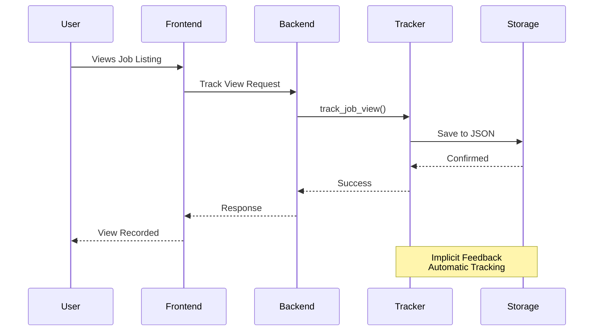

**Implementation:**
```python
def track_job_view(self, resume_file, job_link, job_title):
    user_id = self.get_user_id_from_file(resume_file)
    interactions = self._load_interactions()
    
    if user_id not in interactions:
        interactions[user_id] = {
            'jobs_viewed': [],
            'jobs_clicked': []
        }
    
    # Add view (avoid duplicates)
    view_entry = {'job_link': job_link, 'job_title': job_title, 
                  'timestamp': time.time()}
    if view_entry not in interactions[user_id]['jobs_viewed']:
        interactions[user_id]['jobs_viewed'].append(view_entry)
    
    self._save_interactions(interactions)
```

### 3.7.2. Track Job Clicks (Explicit Feedback)

**Implementation:**
```python
def track_job_click(self, resume_file, job_link, job_title):
    user_id = self.get_user_id_from_file(resume_file)
    interactions = self._load_interactions()
    
    if user_id not in interactions:
        interactions[user_id] = {
            'jobs_viewed': [],
            'jobs_clicked': []
        }
    
    # Add click (avoid duplicates)
    click_entry = {'job_link': job_link, 'job_title': job_title, 
                   'timestamp': time.time()}
    if click_entry not in interactions[user_id]['jobs_clicked']:
        interactions[user_id]['jobs_clicked'].append(click_entry)
    
    self._save_interactions(interactions)
```

### 3.7.3. User ID Generation from Resume File

**Method:**
```python
def get_user_id_from_file(self, resume_file):
    # Use file path hash as user ID
    import hashlib
    file_hash = hashlib.md5(resume_file.encode()).hexdigest()
    return f"user_{file_hash[:8]}"
```

**Benefits:**
- Consistent user identification
- Privacy-preserving (no personal info)
- Works with file-based system

### 3.7.4. JSON Storage Structure

**Storage Format:**
```json
{
    "user_abc12345": {
        "jobs_viewed": [
            {
                "job_link": "https://...",
                "job_title": "Software Engineer",
                "timestamp": 1234567890.123
            }
        ],
        "jobs_clicked": [
            {
                "job_link": "https://...",
                "job_title": "Data Scientist",
                "timestamp": 1234567890.456
            }
        ]
    }
}
```

**File Location:** `instance/user_interactions.json`

---

## 3.8. Course Recommendation Module (`course_recommender.py`)

### 3.8.1. Load and Merge 4 Course Datasets

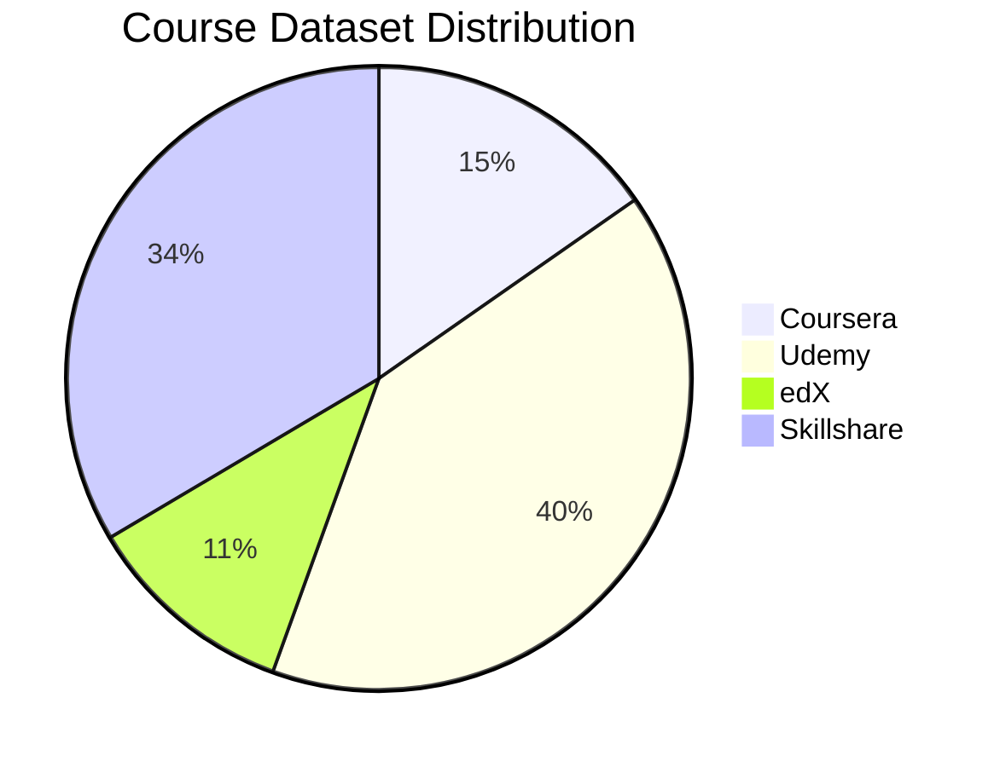

**Datasets:**
1. **Coursera**: ~1,141 courses
2. **Udemy**: ~Thousands of courses
3. **edX**: ~818 courses
4. **Skillshare**: ~Thousands of courses

**Loading Process:**
```python
def _load_all_courses(self):
    courses_list = []
    
    # Load Coursera
    coursera = pd.read_csv(f'{self.course_data_dir}/Coursera.csv')
    coursera['platform'] = 'Coursera'
    coursera['skills'] = coursera['skills'].apply(self._parse_coursera_skills)
    courses_list.append(coursera)
    
    # Load edX
    edx = pd.read_csv(f'{self.course_data_dir}/edx.csv')
    edx['platform'] = 'edX'
    edx['skills'] = edx['associatedskills'].apply(self._parse_edx_skills)
    courses_list.append(edx)
    
    # Load Udemy and Skillshare similarly...
    
    # Merge all datasets
    self.all_courses = pd.concat(courses_list, ignore_index=True)
```

### 3.8.2. Parse Skills from Multiple Formats

**Coursera Skills (JSON format):**
```python
def _parse_coursera_skills(self, skills_str):
    try:
        skills_json = json.loads(skills_str)
        return [s.get('name', '') for s in skills_json if s.get('name')]
    except:
        return []
```

**edX Skills (comma-separated):**
```python
def _parse_edx_skills(self, skills_str):
    if pd.isna(skills_str):
        return []
    return [s.strip() for s in str(skills_str).split(',') if s.strip()]
```

**Udemy/Skillshare (text extraction):**
```python
def _extract_skills_from_text(self, text):
    # Use regex or NLP to extract skills
    # Match against skills database
    return extracted_skills
```

### 3.8.3. Missing Skills Identification

**Process:**
```python
def _extract_missing_skills(self, user_skills, job_recommendations_df):
    # Get top 5 job descriptions
    top_jobs = job_recommendations_df.head(5)
    
    # Extract skills from job descriptions
    all_job_skills = set()
    for _, job in top_jobs.iterrows():
        job_desc = str(job.get('description', '')).lower()
        # Extract skills using NLP or keyword matching
        job_skills = self._extract_skills_from_text(job_desc)
        all_job_skills.update(job_skills)
    
    # Find missing skills
    user_skills_lower = [s.lower() for s in user_skills]
    missing_skills = [s for s in all_job_skills 
                     if s.lower() not in user_skills_lower]
    
    return list(missing_skills)
```

### 3.8.4. Course Matching Algorithm

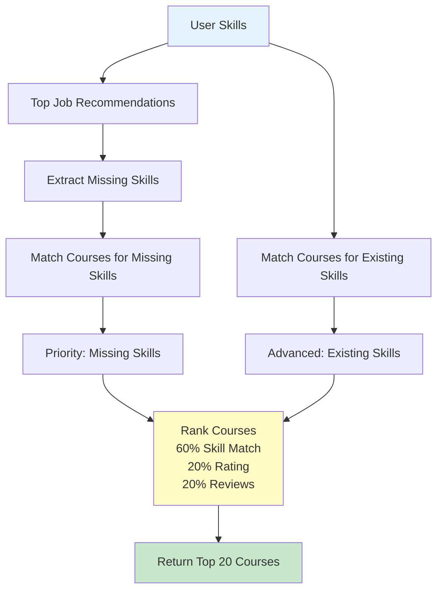

**Matching Process:**
```python
def recommend_courses(self, user_skills, job_recommendations_df, top_n=20):
    # Extract missing skills
    missing_skills = self._extract_missing_skills(user_skills, job_recommendations_df)
    
    # Match courses for missing skills (priority)
    missing_skill_courses = self._match_courses(missing_skills, priority=True)
    
    # Match courses for existing skills (advanced)
    existing_skill_courses = self._match_courses(user_skills, priority=False)
    
    # Combine and rank
    all_courses = missing_skill_courses + existing_skill_courses
    ranked_courses = self._rank_courses(all_courses)
    
    return ranked_courses.head(top_n)
```

### 3.8.5. Ranking Formula

**Multi-Factor Ranking:**
```python
def _rank_courses(self, courses):
    # Calculate scores
    courses['Skill Match Score'] = courses['matched_skills_count'] / courses['total_skills']
    courses['Rating Score'] = courses['rating'] / 5.0  # Normalize to 0-1
    courses['Review Score'] = courses['review_count'] / courses['review_count'].max()
    
    # Weighted combination
    courses['Final Score'] = (
        courses['Skill Match Score'] * 0.6 +  # 60% weight
        courses['Rating Score'] * 0.2 +        # 20% weight
        courses['Review Score'] * 0.2           # 20% weight
    )
    
    return courses.sort_values('Final Score', ascending=False)
```

---

## 3.9. Career Path Advisor Module (`career_path_advisor.py`)

### 3.9.1. Job Title Matching

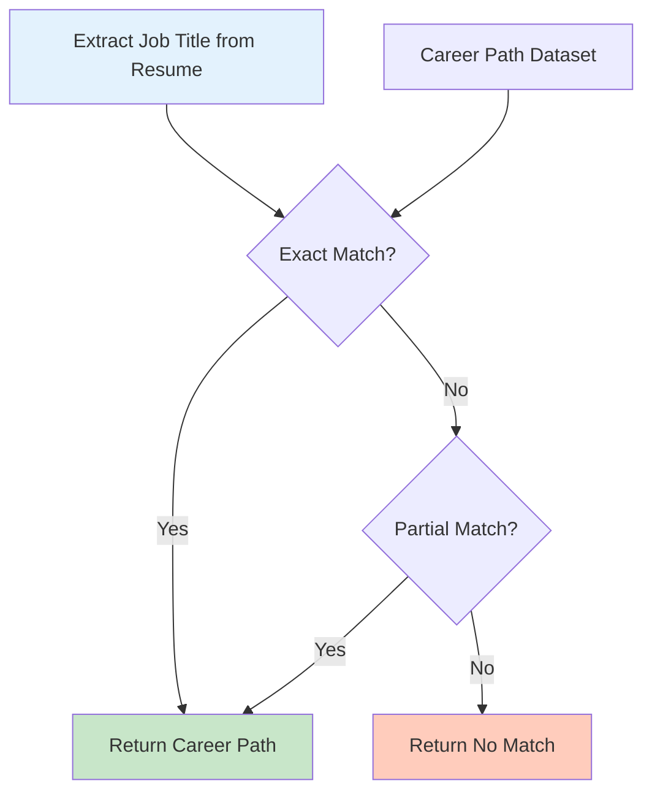

**Process:**
```python
def get_career_path(self, resume_file):
    # Extract current job title from resume
    current_title = self._extract_job_title(resume_file)
    
    # Match with career path dataset
    matched_path = self._match_job_title(current_title)
    
    return matched_path
```

**Matching Logic:**
```python
def _match_job_title(self, job_title):
    job_title_lower = job_title.lower()
    
    # Try exact match first
    exact_match = self.career_path_df[
        self.career_path_df['Job Title'].str.lower() == job_title_lower
    ]
    
    if not exact_match.empty:
        return exact_match.iloc[0]
    
    # Try partial match
    partial_match = self.career_path_df[
        self.career_path_df['Job Title'].str.lower().str.contains(job_title_lower)
    ]
    
    if not partial_match.empty:
        return partial_match.iloc[0]
    
    return None
```

### 3.9.2. Career Progression Lookup

**Dataset Structure:**
- Job Title
- Industry
- Career Path (comma-separated roles)

**Lookup:**
```python
def _get_career_path_roles(self, matched_row):
    if matched_row is None:
        return []
    
    career_path_str = matched_row.get('Career Path', '')
    roles = [role.strip() for role in career_path_str.split(',') if role.strip()]
    return roles
```

### 3.9.3. Path Generation from CSV Dataset

**Loading Dataset:**
```python
def __init__(self):
    self.career_path_df = pd.read_csv('course dataset/careerPath.csv')
```

**Path Generation:**
```python
def get_career_path(self, resume_file):
    matched_row = self._match_job_title(job_title)
    
    if matched_row is None:
        return {
            'success': False,
            'matched_job_title': None,
            'industry': None,
            'career_path': []
        }
    
    roles = self._get_career_path_roles(matched_row)
    
    return {
        'success': True,
        'matched_job_title': matched_row['Job Title'],
        'industry': matched_row.get('Industry', ''),
        'career_path': roles
    }
```

### 3.9.4. Sequential Role Display

The career path is displayed as a sequential list of roles, showing the progression path from the current role to advanced positions.

---

## Summary

This chapter detailed the design and implementation of all major modules in the system. Each module was described with its functionality, algorithms, and code examples. The modular design allows for easy maintenance, testing, and future enhancements. The next chapter will focus on the mathematical foundations and algorithms used throughout the system.

