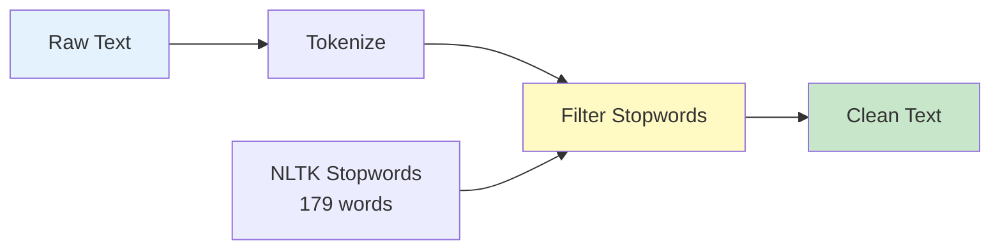
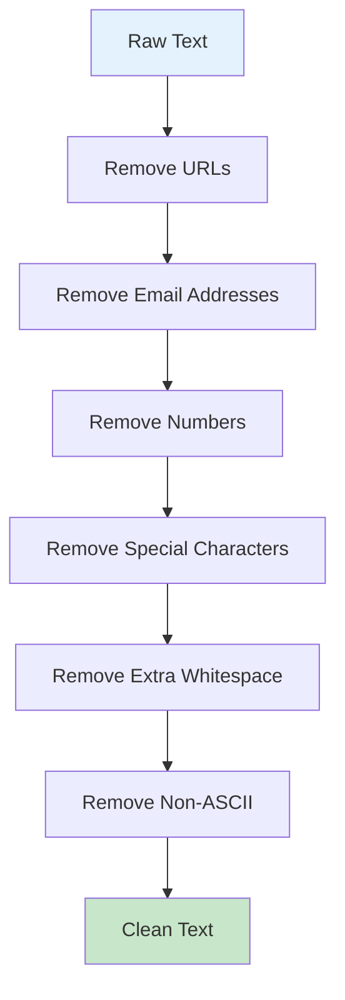
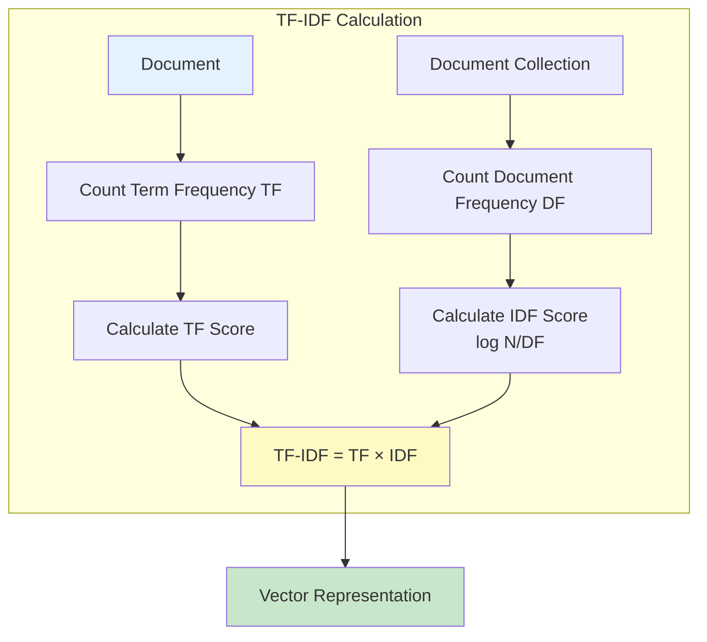
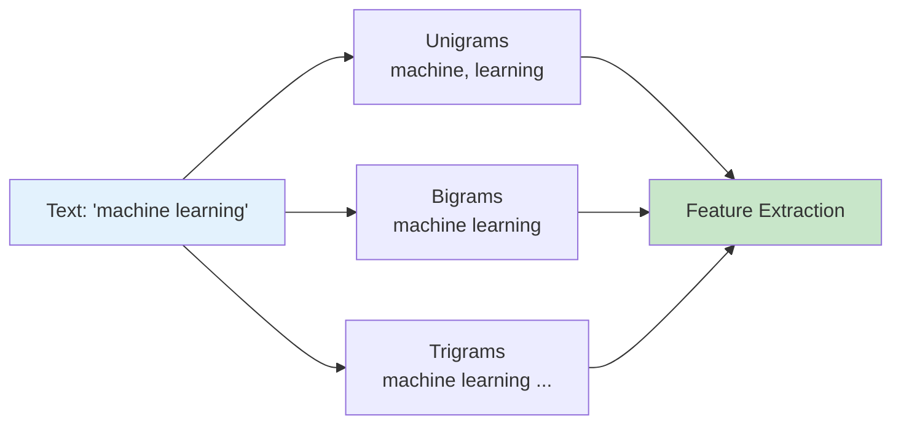
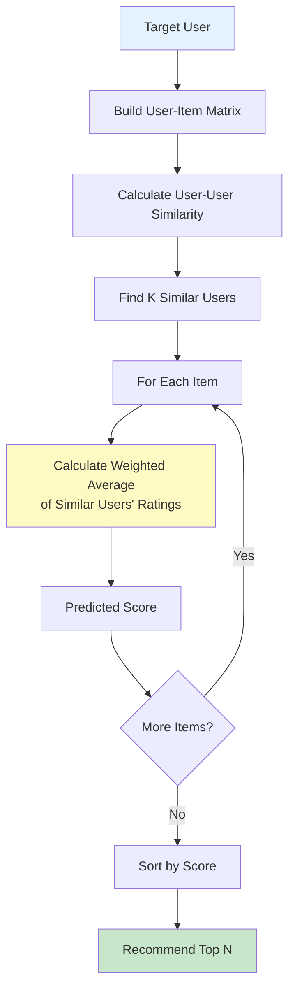
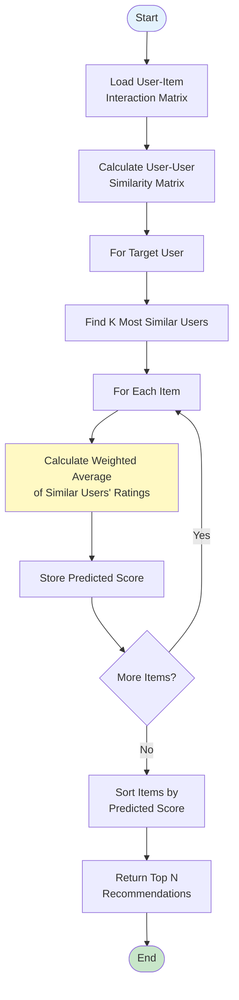
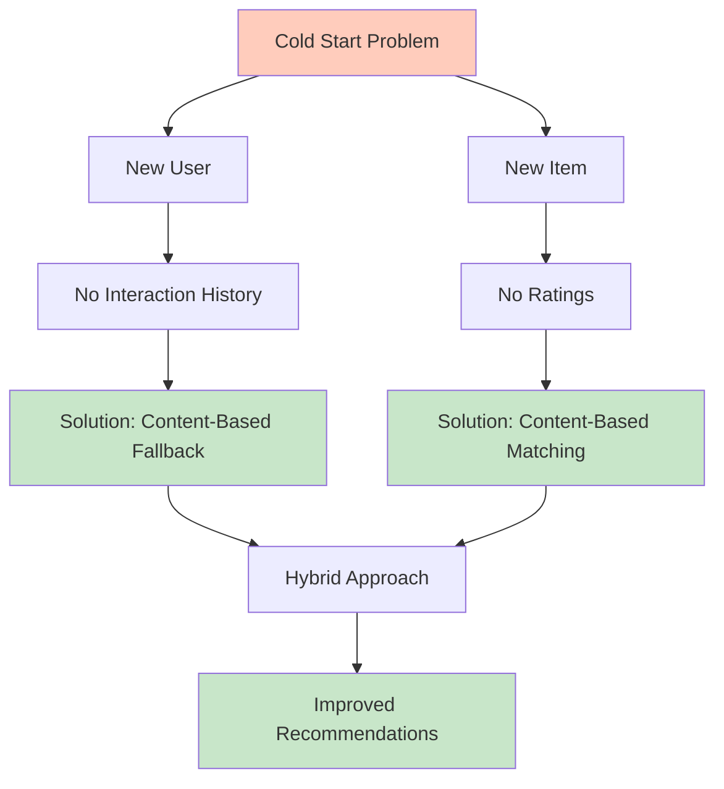
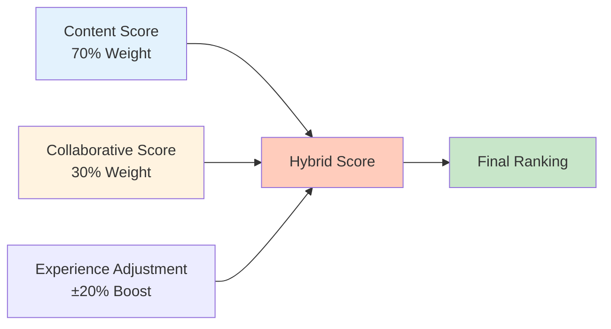
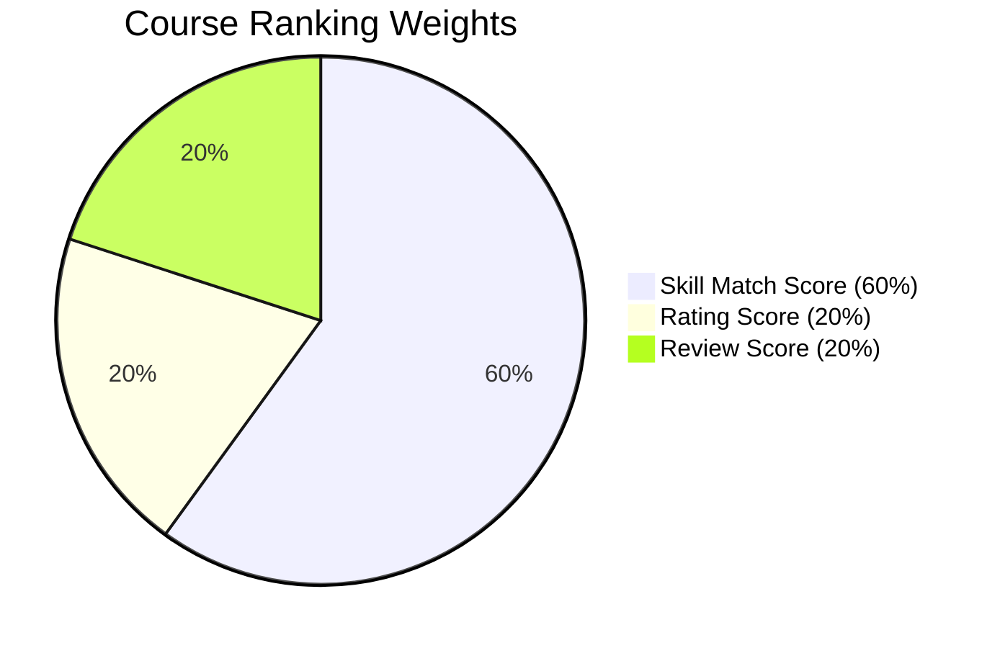

# Chapter 4: Algorithms and Machine Learning Techniques

## 4.1. Text Preprocessing Pipeline

### 4.1.1. Stopwords Removal with NLTK



Stopwords are common words that carry little semantic meaning and are typically removed to reduce noise in text analysis. Examples include "the", "a", "an", "and", "or", "but", etc.

**Implementation:**
```python
from nltk.corpus import stopwords

stopw = set(stopwords.words('english'))

# Remove stopwords from text
filtered_text = ' '.join([word for word in text.split() 
                         if word not in stopw])
```

**Why Remove Stopwords:**
- Reduces dimensionality of feature space
- Focuses on meaningful words
- Improves computational efficiency
- Enhances signal-to-noise ratio

**NLTK Stopwords Corpus:**
- Contains 179 English stopwords
- Includes common words, articles, prepositions, conjunctions
- Can be extended with domain-specific stopwords

### 4.1.2. Tokenization Process

Tokenization is the process of splitting text into individual words or tokens.

**NLTK Tokenization:**
```python
from nltk.tokenize import word_tokenize

tokens = word_tokenize(text)
```

**spaCy Tokenization:**
```python
import spacy

nlp = spacy.load('en_core_web_sm')
doc = nlp(text)
tokens = [token.text for token in doc]
```

**Tokenization Challenges:**
- Handling contractions ("don't" → "do", "n't")
- Preserving special characters when needed
- Handling URLs, emails, and numbers
- Multi-word expressions

### 4.1.3. Lowercasing and Normalization

**Lowercasing:**
```python
text = text.lower()
```

**Purpose:**
- Treats "Python" and "python" as the same word
- Reduces vocabulary size
- Improves matching accuracy

**Normalization Steps:**
1. Convert to lowercase
2. Remove punctuation (context-dependent)
3. Normalize whitespace
4. Handle special characters

**Implementation:**
```python
def casefoldingText(text):
    text = text.lower()
    return text

def cleaningText(text):
    # Remove punctuation
    text = text.translate(str.maketrans('', '', string.punctuation))
    # Normalize whitespace
    text = re.sub(r'\s+', ' ', text)
    return text.strip()
```

### 4.1.4. Regex Patterns for Text Cleaning



**Common Patterns:**

**Remove URLs:**
```python
text = re.sub(r'http\S+\s*', ' ', text)
```

**Remove Email Addresses:**
```python
text = re.sub(r'\S+@\S+', ' ', text)
```

**Remove Numbers:**
```python
text = re.sub(r'\d+', ' ', text)
```

**Remove Special Characters:**
```python
text = re.sub(r'[^\w\s]', ' ', text)
```

**Remove Extra Whitespace:**
```python
text = re.sub(r'\s+', ' ', text)
```

**Remove Non-ASCII Characters:**
```python
text = re.sub(r'[^\x00-\x7f]', "", text)
```

**Complete Cleaning Function:**
```python
def cleaningText(text):
    text = text.replace('\\n', '\n')
    text = text.replace('\\t', '\n')
    text = text.replace('\\r', '\n')
    text = text.replace('\n', ' ')
    text = text.translate(str.maketrans('', '', string.punctuation))
    text = text.replace("'b", ' ')
    text = re.sub(' nan ', ' ', text)
    text = re.sub(r'\\x[0-9a-z]{2}', r' ', text)
    text = re.sub(r'[0-9]{2,}', r' ', text)
    text = re.sub(r'http\S+\s*', ' ', text)
    text = re.sub('RT|cc', ' ', text)
    text = re.sub(r'#\S+', ' ', text)
    text = re.sub(r'@\S+', ' ', text)
    text = re.sub(r'\s+', ' ', text)
    text = text.lower()
    text = re.sub(r'xx+', r' ', text)
    text = re.sub(r'XX+', r' ', text)
    text = re.sub(r'[^\x00-\x7f]', "", text)
    return text.strip()
```

---

## 4.2. TF-IDF Vectorization

### 4.2.1. Mathematical Foundation



**Term Frequency (TF):**

Term Frequency measures how frequently a term appears in a document:

```
TF(t, d) = (Number of times term t appears in document d) / (Total number of terms in d)
```

**Alternative TF Formulas:**

1. **Raw Count:**
   ```
   TF(t, d) = count(t, d)
   ```

2. **Normalized Count:**
   ```
   TF(t, d) = count(t, d) / |d|
   ```

3. **Log Scale:**
   ```
   TF(t, d) = 1 + log(count(t, d))
   ```

**Inverse Document Frequency (IDF):**

IDF measures how important a term is across the entire document collection:

```
IDF(t, D) = log(N / |{d ∈ D : t ∈ d}|)
```

Where:
- N = Total number of documents
- |{d ∈ D : t ∈ d}| = Number of documents containing term t

**TF-IDF Score:**

The TF-IDF score combines both measures:

```
TF-IDF(t, d, D) = TF(t, d) × IDF(t, D)
```

**Properties:**
- High TF-IDF: Term is frequent in document but rare in collection (distinctive)
- Low TF-IDF: Term is rare in document or common in collection (not distinctive)
- Zero TF-IDF: Term doesn't appear in document

### 4.2.2. Implementation with scikit-learn

**TfidfVectorizer:**
```python
from sklearn.feature_extraction.text import TfidfVectorizer

vectorizer = TfidfVectorizer(
    min_df=1,           # Minimum document frequency
    analyzer=ngrams,    # Custom analyzer function
    lowercase=False     # Don't lowercase (already done)
)

tfidf_matrix = vectorizer.fit_transform(documents)
```

**Parameters:**
- `min_df`: Minimum document frequency (filters rare terms)
- `max_df`: Maximum document frequency (filters common terms)
- `analyzer`: Function to extract features (word, char, or custom)
- `ngram_range`: Range of n-grams to extract (e.g., (1, 3) for unigrams to trigrams)
- `lowercase`: Convert to lowercase
- `stop_words`: Remove stopwords

**CountVectorizer (Simpler Alternative):**
```python
from sklearn.feature_extraction.text import CountVectorizer

cv = CountVectorizer()
count_matrix = cv.fit_transform([skills, job_description])
```

**Difference:**
- `CountVectorizer`: Simple word counts
- `TfidfVectorizer`: TF-IDF weighted counts

### 4.2.3. N-grams Analysis



**N-grams** are contiguous sequences of n items (words or characters) from a text.

**Types:**
- **Unigrams (1-grams)**: Individual words ("python", "programming")
- **Bigrams (2-grams)**: Pairs of words ("python programming", "machine learning")
- **Trigrams (3-grams)**: Triplets ("natural language processing")

**Implementation:**
```python
def ngrams(string, n=3):
    string = string.encode("ascii", errors="ignore").decode()
    string = string.lower()
    chars_to_remove = [")","(",".","|","[","]","{","}","'"]
    rx = '[' + re.escape(''.join(chars_to_remove)) + ']'
    string = re.sub(rx, '', string)
    string = string.replace('&', 'and')
    string = string.replace(',', ' ')
    string = string.replace('-', ' ')
    string = string.title()
    string = re.sub(' +',' ',string).strip()
    string = ' '+ string +' '
    string = re.sub(r'[,-./]|\sBD',r'', string)
    ngrams = zip(*[string[i:] for i in range(n)])
    return [''.join(ngram) for ngram in ngrams]
```

**Why N-grams:**
- Captures word order and context
- Better for phrase matching
- Handles multi-word terms ("machine learning", "data science")

### 4.2.4. Advantages and Limitations

**Advantages:**
- **Normalization**: Reduces importance of common words
- **Distinctiveness**: Highlights unique terms
- **Scalability**: Works well with large document collections
- **Interpretability**: Scores are meaningful and explainable

**Limitations:**
- **Semantic Understanding**: Doesn't capture meaning or synonyms
- **Word Order**: Loses some word order information (unless using n-grams)
- **Sparse Vectors**: Creates high-dimensional sparse matrices
- **Domain Dependency**: May not work well for very short texts

---

## 4.3. Cosine Similarity Algorithm

### 4.3.1. Mathematical Formula

```mermaid
graph TB
    subgraph "Cosine Similarity Visualization"
        A[Vector A<br/>Resume Skills] 
        B[Vector B<br/>Job Description]
        A --> C[Calculate Dot Product<br/>A · B]
        B --> C
        A --> D[Calculate ||A||]
        B --> E[Calculate ||B||]
        C --> F[cos θ = A·B / ||A|| ||B||]
        D --> F
        E --> F
        F --> G[Similarity Score<br/>0 to 1]
    end
    
    style A fill:#e3f2fd
    style B fill:#fff3e0
    style G fill:#c8e6c9
```

Cosine similarity measures the cosine of the angle between two non-zero vectors in a multi-dimensional space:

```
similarity = cos(θ) = (A · B) / (||A|| × ||B||)
```

Where:
- **A · B** is the dot product of vectors A and B:
  ```
  A · B = Σ(ai × bi) for i = 1 to n
  ```
- **||A||** is the magnitude (Euclidean norm) of vector A:
  ```
  ||A|| = √(Σ(ai²)) for i = 1 to n
  ```
- **||B||** is the magnitude of vector B:
  ```
  ||B|| = √(Σ(bi²)) for i = 1 to n
  ```

**Simplified Formula:**
```
cos(θ) = (Σ(ai × bi)) / (√(Σ(ai²)) × √(Σ(bi²)))
```

### 4.3.2. Geometric Interpretation

**Vector Representation:**
- Each document is represented as a vector in n-dimensional space
- Each dimension corresponds to a unique term (word)
- Vector values are TF-IDF scores

**Angle Between Vectors:**
- **θ = 0°**: Vectors point in same direction (identical documents)
  - Cosine similarity = 1
- **θ = 90°**: Vectors are orthogonal (no similarity)
  - Cosine similarity = 0
- **θ = 180°**: Vectors point in opposite directions (opposite documents)
  - Cosine similarity = -1

**For TF-IDF Vectors:**
- All values are non-negative (TF-IDF ≥ 0)
- Cosine similarity ranges from 0 to 1
- 0 = No similarity, 1 = Identical

### 4.3.3. Application in Job Matching

**Process:**

1. **Vectorize Resume Skills:**
```python
skills_text = "python machine learning data science"
skills_vector = vectorizer.transform([skills_text])
```

2. **Vectorize Job Description:**
```python
job_text = "We are looking for a Python developer with machine learning experience"
job_vector = vectorizer.transform([job_text])
```

3. **Calculate Similarity:**
```python
from sklearn.metrics.pairwise import cosine_similarity

similarity = cosine_similarity(skills_vector, job_vector)[0][1]
match_percentage = similarity * 100
```

**Implementation in Project:**
```python
def coSim(vector):
    matchPercentage = []
    for vec in vector:
        similarity = cosine_similarity(vec)[0][1]
        matchPercentage.append(similarity * 100)
    return matchPercentage
```

### 4.3.4. Why Cosine Similarity

**Advantages:**

1. **Length Normalization:**
   - Handles documents of different lengths
   - Focuses on direction, not magnitude
   - Prevents longer documents from dominating

2. **Efficient Computation:**
   - Fast calculation with optimized libraries
   - Works well with sparse vectors
   - Scales to large datasets

3. **Interpretability:**
   - Results range from 0 to 1
   - Easy to understand and explain
   - Can be converted to percentages

4. **Suitable for Text:**
   - Works well with TF-IDF vectors
   - Handles high-dimensional sparse data
   - Common in information retrieval

**Comparison with Other Metrics:**

- **Euclidean Distance**: Sensitive to document length
- **Manhattan Distance**: Less intuitive for text
- **Jaccard Similarity**: Only considers presence/absence, not frequency
- **Dot Product**: Not normalized, favors longer documents

---

## 4.4. Collaborative Filtering Algorithm

### 4.4.1. User-Based Collaborative Filtering



**Concept:**
Find users similar to the target user based on their interaction patterns, then recommend items that similar users liked.

**Algorithm Steps:**

1. **Build User-Item Matrix:**
   - Rows: Users
   - Columns: Items (jobs)
   - Values: Interaction scores (clicks, views, ratings)

2. **Calculate User-User Similarity:**
   - Measure similarity between user vectors
   - Use cosine similarity or Pearson correlation

3. **Find Similar Users:**
   - Select k most similar users (nearest neighbors)

4. **Predict Scores:**
   - For each item, calculate weighted average of similar users' ratings
   - Weight by similarity score

5. **Recommend Top Items:**
   - Sort items by predicted score
   - Return top N recommendations

### 4.4.2. User-User Similarity Calculation

**Cosine Similarity Between Users:**
```python
def calculate_user_similarity(user1_vector, user2_vector):
    # Dot product
    dot_product = np.dot(user1_vector, user2_vector)
    
    # Magnitudes
    magnitude1 = np.sqrt(np.sum(user1_vector ** 2))
    magnitude2 = np.sqrt(np.sum(user2_vector ** 2))
    
    # Cosine similarity
    similarity = dot_product / (magnitude1 * magnitude2)
    
    return similarity
```

**Using scikit-learn:**
```python
from sklearn.metrics.pairwise import cosine_similarity

similarity_matrix = cosine_similarity(user_job_matrix)
```

**Pearson Correlation (Alternative):**
```python
from scipy.stats import pearsonr

correlation, _ = pearsonr(user1_vector, user2_vector)
```

### 4.4.3. Score Prediction Formula

**Weighted Average Prediction:**
```
predicted_rating(u, i) = Σ(similarity(u, v) × rating(v, i)) / Σ|similarity(u, v)|
```

Where:
- u = target user
- i = item (job)
- v = similar users who rated item i
- similarity(u, v) = similarity between users u and v
- rating(v, i) = rating of user v for item i

**Implementation:**
```python
def predict_score(user_id, item_id, similar_users):
    numerator = 0.0
    denominator = 0.0
    
    for similar_user_id, similarity in similar_users:
        rating = get_rating(similar_user_id, item_id)
        if rating > 0:
            numerator += similarity * rating
            denominator += abs(similarity)
    
    if denominator == 0:
        return 0.0
    
    predicted_score = numerator / denominator
    return predicted_score
```

**Handling Missing Ratings:**
- Only consider users who have rated the item
- Use weighted average to account for similarity strength
- Return 0 if no similar users rated the item

### 4.4.4. Algorithm Flowchart



### 4.4.5. Cold Start Problem and Solutions



**Cold Start Problem:**
- **New User**: No interaction history, cannot find similar users
- **New Item**: No ratings, cannot be recommended

**Solutions Implemented:**

1. **Fallback to Content-Based:**
   - If collaborative filtering fails, use content-based recommendations
   - Ensures system always provides recommendations

2. **Hybrid Approach:**
   - Combine collaborative and content-based scores
   - Content-based handles new users/items
   - Collaborative improves over time

3. **Implicit Feedback:**
   - Track views in addition to clicks
   - Builds interaction history faster
   - Helps with cold start

4. **Default Recommendations:**
   - Use popular items for new users
   - Use content-based for new items

---

## 4.5. Hybrid Recommendation Strategy

### 4.5.1. Weighted Combination Formula



**Hybrid Score:**
```
Hybrid_Score = (Content_Score × Content_Weight) + 
               (Collaborative_Score × Collaborative_Weight)
```

**In Project:**
```python
content_weight = 1 - collaborative_weight  # Default: 0.7
hybrid_score = (
    content_score * content_weight +
    collaborative_score * 100 * collaborative_weight
)
```

**Normalization:**
- Content score: Already 0-100 (percentage)
- Collaborative score: 0-1 (similarity), multiplied by 100 for consistency

### 4.5.2. Content-Based Weight (70%)

**Rationale:**
- More reliable for new users
- Doesn't require interaction history
- Explainable (based on skills match)
- Works immediately

**When Strong:**
- User has clear skill profile
- Job descriptions are detailed
- Skills match is high

### 4.5.3. Collaborative Weight (30%)

**Rationale:**
- Learns from user behavior
- Discovers unexpected connections
- Improves over time
- Provides diversity

**When Strong:**
- Sufficient user interaction data
- Similar users exist
- User preferences are clear

### 4.5.4. Experience Adjustment (20%)

**Boost/Penalty System:**
```python
if experience_level_matches:
    experience_match = 1.2  # 20% boost
else:
    experience_match = 1.0  # No change

adjusted_score = original_score * experience_match
```

**Application:**
- Junior users: Boost junior positions
- Senior users: Boost senior positions
- Mid-level: Neutral or slight boost for mid positions

### 4.5.5. Parameter Tuning

**Tunable Parameters:**

1. **Collaborative Weight:**
   - Default: 0.3 (30%)
   - Range: 0.0 to 1.0
   - Higher = More reliance on user behavior

2. **Experience Boost:**
   - Default: 1.2 (20% boost)
   - Range: 1.0 to 1.5
   - Higher = Stronger experience filtering

3. **Top K Similar Users:**
   - Default: 10
   - Range: 5 to 20
   - Higher = More diverse recommendations

**Tuning Strategy:**
- Start with defaults
- Monitor recommendation quality
- Adjust based on user feedback
- A/B testing for optimal values

### 4.5.6. Performance Comparison

**Content-Based Only:**
- Pros: Fast, reliable, explainable
- Cons: Limited diversity, over-specialization

**Collaborative Only:**
- Pros: Diverse, learns preferences
- Cons: Cold start, requires data

**Hybrid (70/30):**
- Pros: Best of both worlds, robust
- Cons: Slightly slower, more complex

**Results:**
- Hybrid approach provides better accuracy
- Improved user satisfaction
- Handles edge cases better
- More reliable recommendations

---

## 4.6. Course Ranking Algorithm

### 4.6.1. Multi-Factor Ranking Formula



**Final Score Calculation:**
```
Final_Score = (Skill_Match_Score × 0.6) + 
              (Rating_Score × 0.2) + 
              (Review_Score × 0.2)
```

**Component Scores:**

1. **Skill Match Score (60% weight):**
   ```
   Skill_Match_Score = matched_skills_count / total_skills_in_course
   ```
   - Measures how many required skills the course covers
   - Higher = More relevant to user needs

2. **Rating Score (20% weight):**
   ```
   Rating_Score = course_rating / 5.0
   ```
   - Normalizes rating to 0-1 scale
   - Higher = Better user reviews

3. **Review Score (20% weight):**
   ```
   Review_Score = review_count / max_review_count
   ```
   - Normalizes review count to 0-1 scale
   - Higher = More popular/trusted course

### 4.6.2. Skill Match Weight (60%)

**Rationale:**
- Primary factor: Course must match user's needs
- Skill relevance is most important
- Ensures courses address skill gaps

**Calculation:**
```python
matched_skills = set(course_skills) & set(required_skills)
skill_match_score = len(matched_skills) / len(required_skills)
```

### 4.6.3. Rating Weight (20%)

**Rationale:**
- Quality indicator: Higher ratings = better courses
- User satisfaction metric
- Helps filter low-quality courses

**Normalization:**
```python
rating_score = course_rating / 5.0  # Assuming 5-star scale
```

### 4.6.4. Review Count Weight (20%)

**Rationale:**
- Popularity indicator: More reviews = more trusted
- Social proof: Many users = reliable course
- Helps identify established courses

**Normalization:**
```python
max_reviews = courses['review_count'].max()
review_score = course_review_count / max_reviews
```

### 4.6.5. Final Score Calculation

**Implementation:**
```python
def rank_courses(courses):
    # Calculate component scores
    courses['Skill Match Score'] = (
        courses['matched_skills_count'] / courses['total_skills']
    )
    courses['Rating Score'] = courses['rating'] / 5.0
    courses['Review Score'] = (
        courses['review_count'] / courses['review_count'].max()
    )
    
    # Calculate final score
    courses['Final Score'] = (
        courses['Skill Match Score'] * 0.6 +
        courses['Rating Score'] * 0.2 +
        courses['Review Score'] * 0.2
    )
    
    # Sort by final score
    return courses.sort_values('Final Score', ascending=False)
```

**Priority Handling:**
- Missing skill courses: Higher priority
- Existing skill courses: Lower priority
- Separate ranking for each category
- Combine with top N from each

---

## Summary

This chapter explained the mathematical foundations and algorithms used throughout the system. TF-IDF vectorization converts text into numerical representations, cosine similarity measures document similarity, and collaborative filtering learns from user behavior. The hybrid approach combines multiple techniques for robust recommendations. Course ranking uses multi-factor analysis to prioritize relevant courses. These algorithms work together to provide accurate, personalized recommendations for job seekers.

